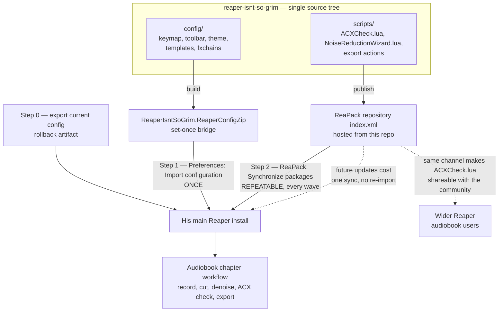

# ADR-0001: Split distribution by change rate — config zip for the bridge, ReaPack for the scripts

## Context and Problem Statement

The kit is two different kinds of artifact wearing one name: a Reaper *configuration* (keymap, toolbar, theme, screensets, project templates, FX chains) and a set of *Lua scripts* (ACX Check, the noise-reduction wizard, the export actions). Reaper offers exactly one native way to move configuration between machines — `.ReaperConfigZip`, a whole-config export/import — and the wider ecosystem offers exactly one standard way to distribute and update scripts: a ReaPack repository. Neither covers the other's ground.

`PLAN.md` proposes shipping everything as a single config zip "he imports once," but the same document schedules four delivery waves (Weekend 1 scripts, Weekend 2 the rest of the bridge, Weekend 3+ the importer, then open-ended Phase 3 tuning). **How do we get the kit onto his machine, and keep it current across those waves, without the update mechanism itself becoming the thing that scares him off?**

## Decision Drivers

* **Adoption is the primary risk, not code.** `PLAN.md` states it outright: "if the first session in Reaper goes badly he'll retreat to Audacity." Every install step is a chance to lose him.
* **The two layers have opposite change rates.** The keymap and toolbar are set-once and then deliberately *retired* over time (Phase 3's graduation path). The scripts — especially ACX Check's readout, which is the flagship and will be tuned against his real feedback — change continuously.
* **Re-importing a config zip is destructive and gets worse over time.** It is a whole-config operation. The longer he uses Reaper, the more of his own settings a re-import puts at risk — precisely as he starts customizing, which is the outcome we want.
* **Delivery is iterative by design.** Milestone 1 explicitly ships the three named must-have scripts *before* the full config package exists. The packaging has to support partial, out-of-order delivery.
* **His main Reaper must keep opening his editor's projects.** He collaborates with an editor who already uses Reaper.
* **Rollback to stock must be one action**, and he must know what it is before he needs it.
* **ACX Check is worth sharing.** `PLAN.md` notes the gap is real for the whole Reaper audiobook community. Distribution that makes sharing natural is worth something beyond this one user.
* **ReaPack cannot carry keymaps or toolbars.** It distributes scripts, effects, themes, langpacks, and templates — the keymap and toolbar `.ini` are outside its package types, so a ReaPack-only answer does not exist.

## Considered Options

* **Split by change rate** — config zip for the bridge, ReaPack repository for the scripts
* **Single `.ReaperConfigZip`**, re-issued and re-imported each wave
* **ReaPack-primary** — everything ReaPack can carry, minimal config zip for the remainder
* **Installer script** (the Ultraschall model) — write files into the Reaper resource folder directly

## Decision Outcome

Chosen option: **"Split by change rate"**, because the two halves of the kit have fundamentally different lifecycles and forcing them into one artifact makes the wrong half expensive. The bridge config is imported once and thereafter only ever shrinks; the scripts are the living part of the product and need an update channel that costs the user one click, not one re-import.

Concretely:

* `config/` builds to **`ReaperIsntSoGrim.ReaperConfigZip`** — keymap, toolbar, theme/screensets, project templates, FX chains. Imported once, via `Preferences → General → Import configuration`.
* `scripts/` publishes as a **ReaPack repository** (an `index.xml` served from this GitHub repo) — `ACXCheck.lua`, `NoiseReductionWizard.lua`, and the export actions. Updated forever via ReaPack's "Synchronize packages."

**Install target: his main Reaper install, with a mandatory backup-first step.** He is coming from Audacity, so his Reaper install is near-stock and there is little to protect; one Reaper is one less concept to explain, and a second portable Reaper is a live opportunity to open the wrong one. Step zero of the README is exporting his current configuration, which makes rollback a single import. Portable install remains documented as an escape hatch in `PLAN.md`'s "Compatibility" section, but it is not the target we build and test against.

### Consequences

* Good, because the flagship feature gets a real iteration loop. ACX Check's readout is the thing most likely to need three rounds of "can it also tell me X" — and each round costs him a ReaPack sync rather than a full config re-import.
* Good, because the config zip stays a genuinely one-time operation. It never has to compete with settings he has since changed himself, which removes the sharpest edge of the single-zip option.
* Good, because it matches the graduation story. Phase 3 retires bridge affordances one group at a time; under this split that means editing the config layer while the script layer — the part with lasting value — is untouched.
* Good, because being on ReaPack is what makes `ACXCheck.lua` shareable with the wider Reaper audiobook community at zero extra cost. A config zip is a personal artifact; a ReaPack repo is a public one.
* Good, because partial delivery falls out naturally. Milestone 1 can ship as a ReaPack repo with three scripts and no config zip at all.
* **Bad, because ReaPack becomes a hard dependency installed before anything feels familiar** — pointed directly at the stated adoption risk. This is the real cost of the decision and it is not fully mitigable, only sequenced: the README must install ReaPack *after* the config zip, so the first thing he sees is his own keyboard layout, not a package manager. ADR-0003 (dependency policy) inherits this as a fixed point.
* Bad, because there are now two artifacts that can drift — a script expecting a toolbar button the installed zip does not have. Both must carry a shared version stamp emitted by one build; ADR-0002 (config source of truth and build pipeline) has to solve this or the drift is real.
* Bad, because publishing a ReaPack repo means maintaining an `index.xml` and its hosting, which is repo machinery the single-zip option does not need.
* Bad, because targeting the main install means a botched import lands on the same Reaper he uses for his editor's projects. Backup-first mitigates this; it does not eliminate it.
* Neutral, because SWS may separately become a dependency (ADR-0004, ACX Check measurement). If it does, ReaPack is already installed and SWS install stops being an additional concept.

### Confirmation

* **Backup rehearsal is part of acceptance, not just documentation.** Before he is handed the kit, the sequence "export config → import kit → import backup → confirm stock Reaper" is walked once end to end. A rollback path nobody has executed is not a rollback path.
* **A script-only update must require zero config re-import.** Ship a trivial `ACXCheck.lua` revision through ReaPack and confirm it lands without touching the config zip. This is the property the whole decision exists to buy; if it fails, the decision is wrong.
* **Both artifacts carry the same version stamp**, produced by a single build invocation, and the build fails if they disagree.
* **The `PLAN.md` Phase 1 acceptance test runs against a main install** that followed the README in order — record, cut a flubbed line, denoise, export an ACX-passing MP3, without touching an unrecognized menu.
* **One of his editor's real `.rpp` projects opens correctly** on the configured install.

## Pros and Cons of the Options

### Split by change rate — config zip + ReaPack

Two artifacts from one repo, divided along the line where change rate changes.

* Good, because each layer gets the delivery mechanism actually designed for it.
* Good, because the update path for the iterating layer costs the user one click.
* Good, because the one-time layer stays non-destructive after first import.
* Good, because it puts the reusable piece (ACX Check) on the ecosystem's standard channel.
* Good, because it supports the plan's own out-of-order milestone delivery.
* Neutral, because it presumes ReaPack is an acceptable dependency — a question ADR-0003 formally owns, though this decision effectively settles it.
* Bad, because first-run install is two steps instead of one, against the primary risk.
* Bad, because two artifacts can drift, requiring a shared version discipline.

### Single `.ReaperConfigZip`, re-issued each wave

Everything in one file, including scripts, re-imported whenever anything changes.

* Good, because first-run install is genuinely one step with zero third-party dependencies — the lowest-friction possible answer to the primary risk.
* Good, because it is exactly what `PLAN.md` proposes, and KISS is a stated principle.
* Good, because there is no version drift; there is only one artifact.
* Bad, because it has no update channel at all. Every script fix is a full re-import.
* Bad, because re-import is whole-config and grows more destructive the more he customizes — it actively punishes the behavior the project is trying to produce.
* Bad, because it makes ACX Check hard to share; a config zip is not a distribution format anyone else will consume.
* Bad, because it forces bundling — Weekend 1's three scripts cannot ship without deciding what config accompanies them.

### ReaPack-primary

Push everything ReaPack supports through ReaPack; a minimal config zip carries only the keymap and toolbar.

* Good, because it maximizes the surface that has an update path.
* Good, because it is the most ecosystem-native shape, and most legible to other Reaper users.
* Bad, because ReaPack install becomes step one, before anything familiar has appeared — the worst possible ordering against the adoption risk.
* Bad, because it pushes set-once artifacts (theme, templates) onto an update channel they do not need, adding sync surface for no benefit.
* Bad, because a keymap-and-toolbar-only config zip is an awkward, hard-to-explain artifact.

### Installer script (Ultraschall model)

A script that writes into the Reaper resource folder directly, handling backup, install, and rollback itself.

* Good, because it offers the best possible first-run experience — one command, automatic backup, real uninstall.
* Good, because it can enforce ordering and verify preconditions rather than trusting a README.
* Good, because Ultraschall proves the model works at much larger scale.
* Bad, because it is the only option that requires building and maintaining genuine cross-platform install tooling for macOS and Windows — a second product alongside the kit, and squarely against the plan's "we are not writing an app" principle.
* Bad, because resource-folder paths and layout are Reaper implementation details that the native config import handles for us.
* Bad, because the effort lands entirely on install, which is a one-time event, rather than on ACX Check, which is the actual value.

## Architecture Diagram

## More Information

* Reaper's native config export/import is the documented whole-config mechanism — see the [reapertips export guide](https://www.reapertips.com/post/how-to-export-backup-reaper) and [X-Raym's config-zip tooling](https://www.extremraym.com/en/reaper-config-zip/).
* [ReaPack user guide](https://reapack.com/user-guide) for repository format and the synchronize flow.
* [Ultraschall](https://ultraschall.fm/) is the prior art for the installer option, and the reason it is credible rather than hypothetical.
* Context and the four-wave milestone schedule: `PLAN.md`, "The three phases" and "Milestones."

**Decisions this one hands off:**

* **ADR-0002 (config source of truth and build pipeline)** inherits the two-artifact version-stamp requirement named under Consequences. It must also settle whether `config/` is hand-authored text or exported-from-Reaper blobs — a question this ADR deliberately does not touch.
* **ADR-0003 (third-party dependency policy)** inherits ReaPack as an already-committed dependency. It should decide the ceiling for everything else (SWS, ReaImGui, js_ReaScriptAPI) knowing ReaPack is a fixed point rather than an open question.
* **ADR-0004 (ACX Check measurement architecture)** is where a possible SWS dependency gets decided; the "SWS install stops being an additional concept" argument above is an input to that decision, not a conclusion of it.

*No call graph is embedded: the repository contains no source code yet, so there is nothing to graph.*
