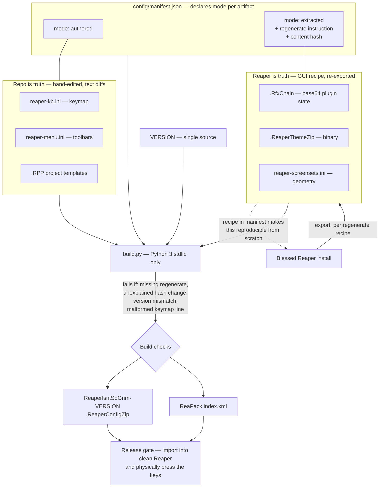

# ADR-0002: Split config source of truth by format, build with stdlib Python

## Context and Problem Statement

`config/` is not one kind of thing. Reaper's configuration formats fall into two genuinely different classes:

* **Line-oriented plain text** — `reaper-kb.ini` (the keymap) and `reaper-menu.ini` (toolbars) are readable, diffable, and writable by hand or by an agent.
* **Opaque or binary** — `.RfxChain` files embed each plugin's state as base64 blobs, `.ReaperThemeZip` is a binary archive of images, and `reaper-screensets.ini` stores machine-generated window geometry. None of these can be meaningfully hand-authored.

So the tempting framing — "hand-authored text in git" versus "exported blobs from Reaper" — poses a choice that does not exist. Half the artifacts refuse one option and half refuse the other. Separately, [ADR-0001](ADR-0001-distribution-and-install-model.md) ships two artifacts (a `.ReaperConfigZip` and a ReaPack `index.xml`) that must carry a shared version stamp, which makes some build step mandatory regardless.

**For each configuration artifact, where does truth live — the repository or a Reaper install — and what assembles the shippable output?**

## Decision Drivers

* **The formats are not uniform**, and a policy that pretends otherwise will be violated on contact with the first `.RfxChain`.
* **The keymap is the highest-stakes artifact on both axes.** It changes most (Phase 3 retires bridge bindings "one group at a time," which is a long series of small edits), it matters most to adoption (a wrong binding presents as "the key does nothing"), and it is the one an agent can actually write. It has to be reviewable as text.
* **`PLAN.md` already assumes hand-authoring**: "Claude Code writes the scripts, keymap and templates; you verify in Reaper."
* **ADR-0001 requires a shared version stamp** across two artifacts, so a build step exists whether or not this ADR wants one.
* **A blessed Reaper profile is a machine-local secret** unless something in the repo says how to recreate it. Projects that depend on one surviving laptop are one laptop away from being unbuildable.
* **`PLAN.md` sets stdlib-only Python 3 for the Phase 2 importer.** A second tooling language would be a gratuitous second thing to maintain.
* **The build may need to run on Windows.** Tooling should not assume a POSIX shell.
* **There is a mandatory human verification loop regardless** — Phase 1 config can only be truly validated by importing it into Reaper and pressing keys. No build check substitutes for that.

## Considered Options

* **Split truth by format, declared in a manifest**
* **Repo is truth for everything**, with blobs committed as generated artifacts
* **A golden Reaper profile is truth**, extracted into `config/` by script
* **No build step** — assemble the config zip by hand in Reaper and commit the finished file

For build tooling: **stdlib-only Python 3**, a **Makefile driving small scripts**, a **shell script**, or **GitHub Actions only**.

## Decision Outcome

Chosen option: **"Split truth by format, declared in a manifest,"** built by **stdlib-only Python 3**, because it is the only option that tells the truth about Reaper's formats while keeping the artifact that matters most — the keymap — inside a normal review workflow.

### Truth modes

Every artifact under `config/` is declared in `config/manifest.json` with exactly one truth mode:

| Mode | Truth lives in | Applies to | Edited by |
|---|---|---|---|
| `authored` | The repository | `reaper-kb.ini`, `reaper-menu.ini`, `.RPP` project templates | Editing the file directly; reviewed as a text diff |
| `extracted` | A blessed Reaper install | `.RfxChain` FX chains, `.ReaperThemeZip`, `reaper-screensets.ini` | Performing a documented GUI recipe in Reaper, then re-exporting |

An `authored` artifact **may be seeded once** from a Reaper export — that is how a `.RPP` template gets its first hundred lines — but from that moment the repository owns it and Reaper does not. This keeps exactly two modes rather than three, so the rule stays enforceable.

JSON is the manifest format rather than TOML specifically to avoid a Python 3.11 floor from `tomllib`. The cost is that JSON has no comments, which is why the prose lives in a field instead:

**Every `extracted` entry MUST carry a non-empty `regenerate` instruction** — the actual click path that reproduces it ("New project → insert ReaFir/ReaEQ/ReaComp/ReaLimit → set values per `docs/voice-chain.md` → right-click FX chain → Save chain as…"). The build fails if one is missing. This single rule is what stops the blessed profile from becoming an unreproducible machine-local artifact, and it is the load-bearing part of the decision.

### Build

`build.py` — Python 3, standard library only (`zipfile`, `xml.etree`, `json`, `hashlib`) — reads a single `VERSION` file and emits both artifacts stamped from it: `dist/ReaperIsntSoGrim-<version>.ReaperConfigZip` and the ReaPack `index.xml`. Single-sourcing the version makes ADR-0001's stamp requirement true by construction; the build asserts it anyway, because a requirement nobody checks is a comment.

### Consequences

* Good, because the keymap stays a reviewable text diff. Phase 3's graduation path — retiring bridge bindings one group at a time — becomes a legible series of small PRs with a one-line rationale each, which is exactly the shape `PLAN.md` describes.
* Good, because an agent can do real work in `config/`. Under a golden-profile policy, `config/` would be off-limits to Claude Code entirely, and `PLAN.md`'s stated division of labor would be fiction.
* Good, because nobody wastes an afternoon trying to hand-write base64 ReaComp state before discovering it is not possible.
* Good, because `regenerate` instructions make the blessed profile reproducible from nothing. The project survives losing the machine.
* Good, because one language covers the build and the Phase 2 importer, with no install step, and it runs on Windows.
* **Bad, because a hand-authored `reaper-kb.ini` can be silently wrong.** Reaper tends to skip malformed lines rather than reject the file, so an authoring error surfaces to the user as "that key does nothing" — the precise confusing failure this entire project exists to design away. Build-time parsing catches structural errors; it cannot catch a syntactically valid binding pointing at the wrong action ID. **Only pressing the key in Reaper catches that**, which is why hand verification is a release gate below and not a suggestion.
* Bad, because two truth modes create a lookup step: a contributor must consult the manifest before editing, and editing an `extracted` file directly is a mistake that produces a plausible-looking diff. Mitigation: the manifest records a content hash for each `extracted` artifact, and the build fails when a hash changes without the manifest entry being touched in the same commit. This is a speed bump, not a wall.
* Bad, because `regenerate` prose can drift from reality silently — Reaper's menus move between versions, and nobody notices until someone follows the recipe. Mitigation is the exercise requirement under Confirmation, but the drift risk is real and permanent.
* Neutral, because the build machine now needs Python 3. The buddy never builds anything, so this cost lands only on the developer.

### Confirmation

* **The build fails** if any `extracted` entry lacks a `regenerate` string, if an `extracted` artifact's hash changed without its manifest entry changing, or if the two output artifacts disagree on version.
* **The build parses `reaper-kb.ini`** and rejects structurally malformed lines rather than shipping them.
* **Hand verification is a release gate.** Before any wave ships, the built zip is imported into a clean Reaper and a sampled set of bindings is physically pressed. Per `PLAN.md`: "Claude Code writes… you verify in Reaper." No structural check substitutes for this.
* **At least one `regenerate` recipe is exercised end to end** — rebuild one `.RfxChain` from its instruction and confirm the result matches. A recipe nobody has followed is a guess.

## Pros and Cons of the Options

### Split truth by format, declared in a manifest

Two modes, one lookup table, one rule that keeps the extracted half reproducible.

* Good, because it matches what the formats actually permit.
* Good, because the highest-churn, highest-stakes artifact stays reviewable.
* Good, because `regenerate` converts a machine-local profile into repo knowledge.
* Neutral, because it introduces a manifest — a small piece of project-specific machinery that has to be maintained.
* Bad, because contributors must know a file's mode before editing it.
* Bad, because hand-authored text can be silently wrong in ways only Reaper reveals.

### Repo is truth for everything

`config/` is canonical; opaque blobs are committed as generated artifacts, and any GUI change must be hand-round-tripped back.

* Good, because it is the simplest rule to state, and gives the strongest review story on paper.
* Good, because there is exactly one place to look for truth.
* Bad, because the round-trip discipline is unenforceable. The first time a value gets tweaked in Reaper and not carried back, the repo is quietly wrong and nothing detects it.
* Bad, because it claims authority over files it cannot actually edit, which makes the policy aspirational rather than operative.

### A golden Reaper profile is truth

Maintain one blessed install; a script extracts its resource folder into `config/`.

* Good, because every artifact is guaranteed valid — it came out of Reaper, so Reaper accepts it.
* Good, because there is no format-authoring risk at all, including the silent keymap failure named above.
* Good, because it is the least effort to operate day to day.
* Bad, because every config PR becomes an opaque blob diff, which makes Phase 3's incremental graduation path unreviewable.
* Bad, because the profile is machine-local and cannot be rebuilt from the repository.
* Bad, because it excludes Claude Code from `config/` entirely, contradicting `PLAN.md`'s division of labor.

### No build step

Assemble the config zip by hand in Reaper and commit the finished file.

* Good, because it requires no tooling whatsoever.
* Bad, because it cannot satisfy ADR-0001's shared version stamp across the zip and the ReaPack index.
* Bad, because it offers zero reviewability — the entire kit becomes one binary blob in git.
* Bad, because it makes partial delivery impossible; nothing can ship without rebuilding everything by hand.

### Build tooling: stdlib-only Python 3 (chosen) versus the alternatives

* **Python 3, stdlib only** — Good, because it is the same toolchain and same dependency-free constraint `PLAN.md` sets for the importer; `zipfile` and `xml.etree` are both stdlib; identical behavior on macOS and Windows. Bad, because it requires a Python 3 install on the build machine.
* **Makefile driving scripts** — Good, because `make build` is self-documenting and familiar. Bad, because `make` is awkward on Windows and you maintain both the Makefile and the scripts it calls.
* **Shell script only** — Good, because it assumes only a POSIX shell. Bad, because generating a valid ReaPack `index.xml` means string-templating XML, and it does not run on Windows without WSL or Git Bash.
* **GitHub Actions only** — Good, because it gives a clean tagged-release story. Bad, because you cannot build locally before pushing, which is untenable for a project whose config must be hand-verified in Reaper anyway.

## Architecture Diagram

## More Information

* [ADR-0001](ADR-0001-distribution-and-install-model.md) established the two-artifact split and the shared version stamp this ADR implements. It is the reason a build step is non-optional.
* `PLAN.md`, "Repo layout" for the `config/` structure, and its workflow note — "Claude Code writes the scripts, keymap and templates; you verify in Reaper" — which this decision is designed to make literally true.
* `PLAN.md`, Phase 3 item 1 (graduation path) is the requirement that forces keymap reviewability; retiring bindings "one group at a time" is only auditable if each group is a readable diff.

**Open questions this ADR does not settle:**

* The exact `manifest.json` schema and the build's check semantics belong in a spec, not here. `/sdd:spec` is the next step for that.
* Whether the blessed Reaper install used for `extracted` artifacts should itself be a portable install (isolating it from the developer's daily Reaper) is a workflow question worth deciding before the first `.RfxChain` is produced.
* **ADR-0003** (third-party dependency policy) is unaffected by this decision but still owes an answer on SWS, ReaImGui, and js_ReaScriptAPI, with ReaPack already settled by ADR-0001.
