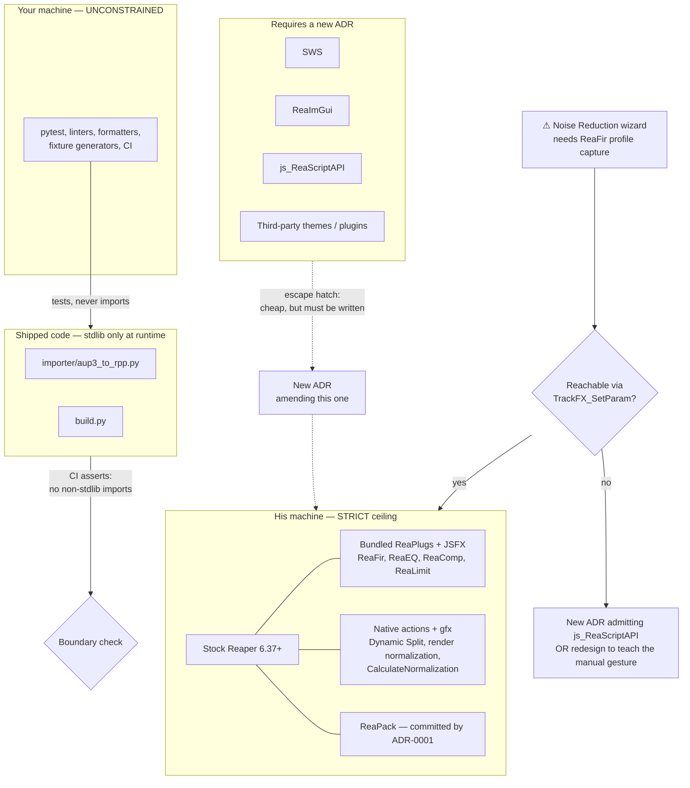

# ADR-0003: Stock Reaper plus ReaPack is the runtime ceiling; development tooling is unconstrained

## Context and Problem Statement

Every dependency the kit requires is an install step standing between an intimidated user and the first thing that feels familiar. `PLAN.md` names the risk precisely: "the biggest real risk is adoption, not code — if the first session in Reaper goes badly he'll retreat to Audacity."

[ADR-0001](ADR-0001-distribution-and-install-model.md) already spent that budget once by committing to ReaPack. It softened the cost with an argument that has since been withdrawn — that SWS would probably become a dependency anyway, so ReaPack would stop being an additional concept. [ADR-0004](ADR-0004-acx-check-measurement.md) removed that assumption: the flagship measures ACX compliance with stock Reaper DSP and needs no extension at all.

That leaves this decision without a forcing function, which is the best possible moment to make it. **What may the kit require on his machine, and does the same standard bind the tooling that never leaves ours?**

## Decision Drivers

* **Adoption is the primary risk.** The second install step costs more than the first, because it arrives after the user has already been asked to trust one unfamiliar thing.
* **Nothing currently forces an extension.** Every Phase 1 feature maps to stock Reaper: ReaFir is a stock ReaPlug, Dynamic Split is a native action, render normalization is native, `CalculateNormalization` is native, and `gfx` is built in.
* **With no default, the ceiling only ever ratchets up.** Each individual "just add the dependency" is locally reasonable; the aggregate is Ultraschall.
* **We cannot reproduce his environment.** A bug that only appears on his install is expensive to diagnose remotely, so the number of environment variants must stay at one.
* **Success is deleting most of Phase 1.** `PLAN.md` Phase 3 retires the bridge. Dependencies acquired for bridge features outlive the features that justified them.
* **Development tooling has none of these properties.** Nothing in `importer/tests/` reaches his machine, and `PLAN.md`'s "stdlib only" constraint is about the shipped importer module, not about how it is tested.
* **The most agent-friendly phase is the test-heavy one.** `PLAN.md` calls the Phase 2 importer "fully testable headless" and therefore the most Claude Code-friendly work in the project. Constraining its test tooling would tax exactly the phase that benefits most from being well tested.

## Considered Options

**Runtime ceiling:** stock Reaper + ReaPack only · SWS permitted as an optional enhancement · SWS as an accepted hard dependency · case-by-case with no standing policy

**Policy scope:** split ceilings (runtime strict, development free) · one ceiling for everything · runtime only, silent on development tooling

## Decision Outcome

### Runtime: stock Reaper plus ReaPack. Nothing else.

Chosen because nothing has demanded more, and the moment to set a ceiling is before something does. Concretely:

* **Permitted:** stock Reaper (6.37 or newer, per ADR-0004's use of `CalculateNormalization`), its bundled ReaPlugs and JSFX, its native actions, `gfx`, and ReaPack as the script delivery channel.
* **Not permitted without a new ADR:** SWS, ReaImGui, js_ReaScriptAPI, third-party themes, third-party plugins of any kind.

Adding one later is not forbidden — it costs one ADR. That is deliberately cheap, because the goal is not to prevent dependencies but to prevent *unargued* ones. A decision that has to be written down is a decision someone has weighed.

**Optional dependencies are rejected explicitly, not merely unchosen.** "Works without SWS, better with it" is the option that sounds safest and is actually worst here: it doubles the test surface, creates two support matrices, and means the first bug report arrives from an environment we did not know he was in. For a kit with one user and no telemetry, a feature must either require a thing or not use it.

### Development: unconstrained, with one boundary

Anything that never reaches his machine — test frameworks, linters, formatters, fixture generators, CI — is unconstrained. The boundary is a single rule:

> **A development dependency may never be imported by shipped code.** `importer/aup3_to_rpp.py` and `build.py` remain standard-library-only at runtime. Their test suites may use whatever is useful.

This resolves an ambiguity `PLAN.md` leaves open. "Python 3, stdlib only" describes the module he might one day run, not the harness that proves it correct. Under the alternative reading, testing the `.aup3` importer against real fixtures would mean hand-rolling a test runner for the one phase that is otherwise ideal for automated work.

### The forcing function to watch

The **Noise Reduction wizard** is the feature most likely to break this policy, and it should be treated as gated rather than assumed safe.

Its flow requires driving ReaFir into subtract mode, capturing a noise profile from a room-tone selection, and then disabling profile capture so the captured curve is applied to the rest of the track. If ReaFir exposes profile capture as an automatable parameter, `TrackFX_SetParam` covers it and the wizard is stock. If it does not, the alternative is manipulating ReaFir's window directly — which needs js_ReaScriptAPI and breaks this ceiling on the second-most-important feature in Phase 1.

**This must be spiked before the wizard is designed**, exactly as ADR-0004 gated its measurement approach on a reference-signal test. If the parameter is not reachable, the honest outcomes are a new ADR admitting js_ReaScriptAPI, or a redesign in which the wizard *teaches the manual ReaFir gesture* rather than automating it — which is arguably truer to "learn Reaper for its differences" anyway.

### Consequences

* Good, because the whole kit installs as one config import plus one ReaPack sync, and that is the complete list. It is short enough to fit on the cheat sheet.
* Good, because there is exactly one runtime environment to reason about, which matters when the only person who can reproduce a bug is a non-technical user on another machine.
* Good, because it holds the line through Phase 3. Dependencies acquired for bridge features would otherwise outlive the bridge itself, and `PLAN.md` expects most of Phase 1 to be deleted.
* Good, because the development side stays productive: the importer gets a real test suite, which is what makes Phase 2 the phase an agent can actually own.
* Good, because the ADR-required escape hatch is cheap enough to use honestly. Nobody has to smuggle a dependency in to avoid bureaucracy.
* **Bad, because SWS is genuinely useful and this refuses it pre-emptively.** If a Phase 3 feature wants something SWS provides, the options are reimplement, redesign, or write the ADR — and the first of those is the tempting one, which is how a project ends up maintaining a worse copy of a well-maintained library. The ADR route must stay the obvious choice.
* Bad, because it locks in `gfx` for UI work indefinitely. ADR-0004 already accepted this for ACX Check; this decision extends that cost to every future interface the kit grows.
* Bad, because the noise-reduction risk above is real and unresolved. The policy may be contradicted by the second feature we build, which is an uncomfortable place for a standing rule to sit.
* Neutral, because the Reaper 6.37 floor is now a documented requirement rather than an implicit one. It costs nothing for a new install and should appear in the README.

### Confirmation

* **The ReaFir parameter spike happens before the noise wizard is designed.** Determine whether noise-profile capture is reachable via `TrackFX_SetParam`. A negative result triggers a new ADR or a redesign — not a quiet js_ReaScriptAPI import.
* **A clean-machine install test.** On a Reaper install with no extensions beyond ReaPack, every shipped feature works. This is the policy's only real test, and it must be run before each wave ships rather than assumed.
* **Shipped Python imports nothing outside the standard library.** Checked mechanically in CI against `importer/` and `build.py`, so the runtime/development boundary cannot erode by accident.
* **The README states the Reaper version floor** and lists the complete dependency set in one place.
* **Any new runtime dependency arrives with an ADR** that supersedes or amends this one. A dependency appearing in a diff without one is a review failure.

## Pros and Cons of the Options

### Runtime ceiling

**Stock Reaper + ReaPack only** — Good, because the install story stays two steps and fits on the cheat sheet. Good, because one environment means reproducible behaviour. Good, because nothing currently demands more, so the constraint costs nothing today. Neutral, because it requires the escape hatch to be genuinely cheap, or it will be routed around. Bad, because it refuses a well-maintained library pre-emptively and may push us toward reimplementing parts of it.

**SWS permitted as an optional enhancement** — Good, because it appears to get the benefits without imposing the install. Good, because users who already have SWS get more. Bad, because every affected script grows a conditional branch, doubling the paths that need testing. Bad, because the support matrix doubles for a kit with one user, no telemetry, and no easy way to determine which path he is on. Bad, because the code that runs on his machine is then not the code we primarily test.

**SWS as an accepted hard dependency** — Good, because it removes the question permanently and unlocks a large, well-maintained utility library. Good, because SWS is close to universal among experienced Reaper users, so it is not an exotic ask. Bad, because it spends a second install step before any feature has demanded one, against the primary risk. Bad, because it is the least reversible option: features quietly grow to depend on it, and removal later becomes a rewrite.

**Case-by-case, no standing policy** — Good, because it never constrains a decision prematurely. Bad, because the default in the absence of a policy is always "add it," so the ceiling ratchets up through a series of individually reasonable choices. Bad, because it provides nothing for a code review to point at.

### Policy scope

**Split ceilings** — Good, because it applies strictness where it costs the user and freedom where it costs nobody. Good, because it resolves the stdlib-only ambiguity explicitly rather than leaving it to be argued in a PR. Neutral, because it needs the import boundary enforced mechanically to hold. Bad, because two ceilings is marginally more to remember than one.

**One ceiling for everything** — Good, because it is the simplest rule to state and keeps the repo runnable with zero setup. Bad, because writing `.aup3` fixture tests without a test framework is real friction on the phase `PLAN.md` identifies as most suited to automated work. Bad, because it constrains tooling on grounds — user intimidation — that do not apply to it.

**Runtime only, silent on development** — Good, because it is the narrowest defensible scope. Bad, because it leaves the stdlib-only question genuinely unresolved at exactly the point it first comes up, which is the ambiguity this ADR exists to remove.

## Architecture Diagram

## More Information

* [ADR-0001](ADR-0001-distribution-and-install-model.md) committed ReaPack and is the reason the ceiling is "stock plus one" rather than "stock."
* [ADR-0004](ADR-0004-acx-check-measurement.md) is why this decision was possible to make freely: it withdrew the assumption that the flagship would force SWS, and it also withdrew ADR-0001's supporting argument that SWS would make ReaPack feel free.
* [ADR-0002](ADR-0002-config-source-of-truth-and-build.md) set stdlib-only Python for the build; this ADR clarifies that the constraint binds shipped code rather than test code.
* `PLAN.md`, "Risks & gotchas" for the adoption risk this policy serves, and "Phase 2" for the stdlib-only importer constraint being interpreted here.
* [Ultraschall](https://ultraschall.fm/) is the counter-example worth keeping in view: an excellent project whose dependency surface is appropriate to its scale and inappropriate to ours.

**Sequencing note:** the ReaFir spike under Confirmation should run early in Weekend 1, alongside ADR-0004's reference-signal spike. Both gate features `PLAN.md` treats as must-haves, and both have outcomes that would send an ADR back for revision. Discovering either in Weekend 2 is much more expensive than discovering both now.
