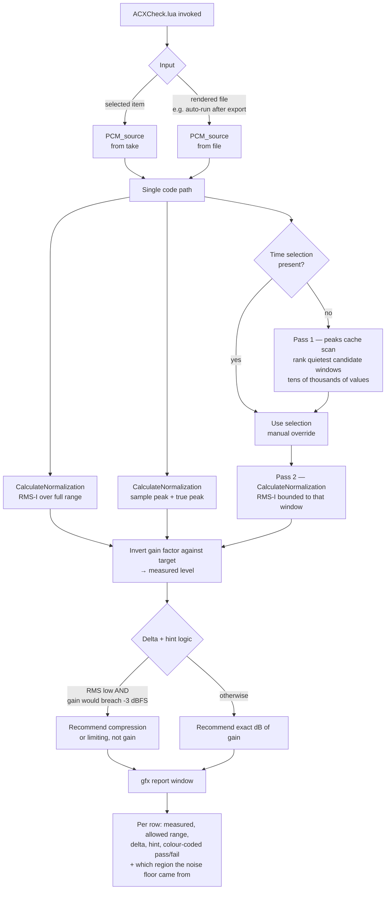

# ADR-0004: Measure ACX compliance with stock Reaper DSP, report in a gfx window

## Context and Problem Statement

ACX Check is the flagship. `PLAN.md` names it as the tool he is most afraid of losing, and what he values about Audacity's version is not the verdict but the **deltas** — how far off each parameter is, and what to do about it. Reproducing that means producing three numbers for a take or a rendered file:

| Measurement | ACX requirement |
|---|---|
| RMS level | between −23 and −18 dBFS |
| Peak level | ≤ −3 dBFS |
| Noise floor | ≤ −60 dBFS |

Two of those are standard loudness statistics. The third is not: **noise floor is measured on room tone**, which means something has to decide *which part of the audio is room tone* before measuring anything.

I originally assumed this feature forced an SWS dependency, and wrote as much into ADR-0001's handoff notes. That assumption was wrong, which changes the shape of this decision and of the dependency policy that follows it. **Where do the three numbers come from, how is the room-tone region chosen, and how is the result presented?**

## Decision Drivers

* **A wrong number is worse than no number.** He will trust this readout and submit against it. An ACX rejection caused by our arithmetic would destroy confidence in the whole kit, so measurement correctness outranks elegance, speed, and independence.
* **It must agree with the tool he already trusts.** He has been reading Audacity's ACX Check output for years. If our numbers disagree with it on the same file, he will believe Audacity and disbelieve us — correctly, since he has no reason to do otherwise.
* **Every extension is an install step in front of an intimidated user.** ADR-0001 already spends his patience once on ReaPack. Spending it again is materially more expensive than the first time.
* **This decision sets the dependency ceiling, not the other way around.** ADR-0003 was slated to decide policy first, but the flagship's actual needs are the only honest input to that policy.
* **One click, and fast.** An hour-long chapter cannot take minutes to check, or the tool will not get used mid-session — and mid-session is where deltas are actionable.
* **The deltas are the product.** Pass/fail is table stakes; "1.6 dB too quiet → raise gain ~2 dB" is the thing worth rebuilding. That requires measured values, not just verdicts.
* **RMS and peak are in tension.** Raising RMS toward −18 raises peaks toward −3. Any gain hint that ignores this is actively harmful advice.
* **Milestone 1 ships this before the config package exists**, so it cannot depend on anything in `config/`.

## Considered Options

**Measurement source:** stock Reaper `CalculateNormalization` · SWS `NF_*` analysis functions · pure Lua DSP over raw samples · JSFX metering with gmem readback

**Noise floor:** auto-detect with manual override · require a room-tone selection · auto-detect only

**Report surface:** `gfx` window · ReaScript console · ReaImGui

## Decision Outcome

### Measurement: stock Reaper

Chosen: **`CalculateNormalization`**, Reaper's own loudness analysis, invoked over an explicit time range. It returns the gain factor that would normalize a source to a given target, so the measured level is recovered by inverting against the target we asked for. It supports RMS-I, sample peak, and true peak, and it accepts a `PCM_source` — which means a take's source and a rendered file on disk go through **one code path**, satisfying `PLAN.md`'s "select an item (or point it at a rendered file)" without a second implementation.

This is chosen over SWS primarily because **the DSP is Reaper's either way**. The SWS route's real advantage would have been trustworthy arithmetic we did not write; stock Reaper offers the same guarantee without the extension. Once that advantage evaporates, SWS is paying an install step for nothing. Pure Lua DSP is rejected on both counts at once — it is the slowest option *and* the only one where an ACX pass/fail rests on arithmetic we wrote ourselves.

**Consequence for ADR-0003: ACX Check requires no extension whatsoever.** The flagship runs on stock Reaper plus a ReaPack sync. The dependency policy inherits a genuinely low floor rather than a forced SWS dependency.

### Peak: report sample peak, show true peak as advisory

ACX specifies −3 dB and Audacity's ACX Check reports **sample peak**. Reporting true peak would be more technically correct and would sometimes disagree with the tool he trusts — turning a correctness improvement into a support burden. The headline number matches Audacity; true peak appears as a secondary advisory line when the two diverge meaningfully.

Verified 2026-08-16: our sample peak on `D1.wav` matches Audacity's to the digit (−14.92). This convention choice was the right one.

**Peak also has a lower bound, which this ADR missed.** (Added 2026-08-16.) His failing screenshot reads:

> Peak level: −14.92 dB **Warning** (too low - may be overly compressed or too quiet.)

Two things follow. Audacity's ACX Check has **three** states — Pass, Warning, Fail — where this ADR and SPEC-0001 model two. And peak is not a ceiling-only test: a peak that is *too low* earns a warning, because it signals over-compression or an under-recorded take. ACX itself specifies −3 dB as a maximum, so the lower bound is Audacity's own editorial judgement rather than a delivery requirement — which is precisely why it must be matched. He reads that warning today, and a tool that silently drops it looks less careful than the one he is leaving.

The distinction is worth preserving in the report rather than collapsing: **Fail means the file will be rejected; Warning means a human should look.** Flattening a warning into a pass hides a real signal, and flattening it into a failure would tell him a deliverable file is broken. Both are worse than carrying the third state.

The exact lower threshold Audacity warns at is not yet known — one observation at −14.92 gives a point, not a boundary — and is to be recovered by the same controlled-observation route as the RMS convention.

### Noise floor: coarse scan, precise measure, manual override

Two passes:

1. **Locate** — read the take's peaks cache (`GetMediaItemTake_Peaks`) at a low rate to find the quietest candidate windows. This reads tens of thousands of values instead of hundreds of millions of samples, so it is effectively instant on a full chapter.
2. **Measure** — run `CalculateNormalization` in RMS mode bounded to the winning window, so the reported figure comes from the same trusted DSP as the other two numbers.

If a time selection exists when the script runs, it is used directly and the scan is skipped — that is the manual override, and it costs no extra UI. The auto-path matches what Audacity already does for him, so the flagship is not a convenience regression on the one tool he is most protective of.

**The design deliberately does not depend on the peaks cache carrying RMS data.** Pass 1 only needs to *rank* candidate regions by quietness, which minimum/maximum amplitude supports on its own. If RMS turns out to be available at that layer it is an optimization, not a requirement.

### Report: `gfx` window

Reaper's built-in immediate-mode graphics, stock on every platform. Colour carries status pre-attentively — he sees red before he reads a number — which matters more for an intimidated user than for a developer. Layout follows `PLAN.md`'s mockup: measured value, allowed range, delta, plain-English hint, one row per measurement.

A row has **three** states, not two — pass, warning, fail — per the peak finding above. That has consequences beyond an extra colour: SPEC-0001 REQ "Status Indication Without Reliance on Colour" currently specifies a glyph and text per state for two states, and needs a third that is visually distinct from both without reading as either. It also means `evaluate.lua` returns a tri-state rather than a boolean, and `report.lua` draws a third style. Recorded here as a consequence of the decision; the spec change and the implementation are separate work.

The gain hint must compute the peak consequence before suggesting anything: if raising RMS by the needed amount would push peaks past −3 dBFS, the hint says so and points at compression or limiting instead of gain. This is the classic ACX tug-of-war and getting it wrong would make the tool confidently misleading.

### Consequences

* Good, because the flagship ships with zero extensions. Milestone 1 is a ReaPack sync and nothing else, which is the cheapest possible first contact with the kit.
* Good, because the numbers are Reaper's own. We are not the ones who could be subtly wrong about RMS.
* Good, because takes and rendered files share one code path, so the audiobook export action can auto-run the check on its own output with no additional machinery — exactly the loop `PLAN.md` describes.
* Good, because the coarse-scan/precise-measure split keeps a full-chapter check fast without sacrificing the accuracy of the reported figure.
* Good, because the manual override is free: an existing time selection is the gesture, so there is no mode, no dialog, and no extra thing to learn.
* Good, because matching Audacity's sample-peak convention means the first side-by-side comparison he runs will agree, which is when trust is won or lost.
* **Bad, because the level-from-gain-factor inversion is cleverness, and cleverness in the one place correctness matters most.** It must be validated against a synthesized reference signal before anything else is built on it. This is the single largest technical risk in the decision.
* Bad, because `gfx` means hand-drawn UI — layout, text metrics, and HiDPI behaviour are ours to own, and none of it is interesting work. ReaImGui would look better for less effort; it costs an install step we are choosing not to spend.
* Bad, because auto-detection can pick wrong. A held breath or a truncated tail can read quieter than genuine room tone, producing a confidently incorrect noise floor. The override exists precisely for this, but it only helps if he notices — so the report must show *which region* was measured, not just the resulting number.
* Neutral, because true peak is computed but demoted. If ACX's requirements are ever interpreted as true-peak, the promotion is a one-line change.

### Confirmation

* **Reference-signal spike, before any other work.** Synthesize tones at known levels (a −20 dBFS RMS sine, a −3 dBFS peak) and confirm the inversion recovers them within tolerance. If this fails, the measurement decision is wrong and the ADR is revisited before code is built on it.
* **Agreement with Audacity on his real material.** The reference request merged in [PR #1](https://github.com/jonstump/reaper-isnt-so-grim/pull/1) asks for exactly the assets this needs: item A3 (his ACX Check output, passing and failing) and items D1/D3 (raw narration with room tone at the head, plus the MP3 it produced). Running our check on D1/D3 and comparing to A3 is the acceptance test that matters. **Disagreement on any of the three numbers blocks release**, whichever tool turns out to be right.

  **The material arrived on 2026-08-16, and the gate is already failing.** His two ACX Check screenshots give the reference values:

  | | Peak | RMS | Noise floor |
  |---|---|---|---|
  | Audacity, passing file | −4.50 Pass | −22.92 Pass | −80.86 Pass |
  | Audacity, `D1.wav` | −14.92 **Warning** | −33.36 **Fail** | −62.02 Pass |
  | Ours, computed directly from `D1.wav` | **−14.92** | −34.13 | −67.88 |

  Sample peak agrees **exactly**, which is the single most important result here: ADR-0004's peak convention, chosen to match Audacity rather than to be technically pure, is correct. RMS is **0.77 dB** apart and noise floor **5.86 dB**. Both exceed the 0.5 dB tolerance, so this is a release blocker per SPEC-0001 REQ "Measurement Validation" — firing exactly as designed, and firing *before* Reaper is involved, since our figure here is direct arithmetic rather than `CalculateNormalization` output. It is a disagreement about convention, not a bug in our code.

  Windowing and sine-reference hypotheses were tested against the file and none close the gap. The convention is to be recovered by controlled observation per [ADR-0005](ADR-0005-license-and-clean-room.md)'s fourth permitted source — feeding Audacity signals of known level and recording what it reports. Reading `ACX-Check.ny`, which ships inside `Audacity.app` and would answer this directly, remains forbidden.
* **Noise-floor auto-pick is validated against D1 specifically**, since it is the only sample with known-genuine room tone at a known position.
* **Performance gate**: a full chapter-length file completes in a couple of seconds, not minutes.
* **The tug-of-war hint is tested against a deliberately constructed case** — audio quiet enough to fail RMS whose peaks are already near −3 — and must recommend dynamics processing rather than gain.
* **The measured noise-floor region is displayed**, so a wrong auto-pick is visible rather than silent.

## Pros and Cons of the Options

### Measurement source

**Stock Reaper `CalculateNormalization`** — Good, because the DSP is Reaper's, so correctness is not ours to get wrong. Good, because it needs no extension, keeping the dependency floor at zero. Good, because it accepts arbitrary time ranges, which is what makes the noise-floor measurement reuse the same trusted path. Good, because one `PCM_source` code path covers takes and files. Neutral, because it requires Reaper 6.44 or newer (the version that introduced `CalculateNormalization`, per spike 9), which is not a real constraint for a new install. Bad, because it returns a gain factor rather than a level, so measurement is by inversion and must be proven.

**SWS `NF_*` functions** — Good, because they return RMS and peak directly with no inversion. Good, because they are the most widely trodden path in the Reaper community, so failure modes are known. Bad, because SWS becomes a hard dependency for the flagship, spending a second install step for arithmetic stock Reaper already provides. Bad, because it does not solve noise floor either, so the two-pass design is needed regardless — meaning SWS buys convenience on the easy two-thirds only.

**Pure Lua DSP** — Good, because it is fully self-contained with total control over the noise-floor heuristic. Bad, because an hour of stereo is 300M+ samples through interpreted Lua, likely minutes per check, which breaks the one-click promise at exactly the length that matters. Bad, because an ACX verdict would rest entirely on DSP we wrote, against the driver that a wrong number is worse than no number.

**JSFX + gmem** — Good, because it is compiled, fast, and fully stock. Good, because it is how serious meters are actually built. Bad, because it requires a playback or render pass to drive it, turning a query into a process. Bad, because gmem plumbing between JSFX and Lua is a permanent debugging surface for a feature that has a simpler correct answer.

### Noise floor

**Auto-detect with manual override** — Good, because it matches Audacity's behaviour, so it is not a regression on his most-valued tool. Good, because the override is an existing gesture rather than new UI. Good, because the coarse scan is cheap enough to be invisible. Bad, because the heuristic can be wrong, which is mitigated but not removed by showing the measured region.

**Require a room-tone selection** — Good, because it is exact, instant, and has no heuristic to misfire. Good, because it reinforces the same gesture the Noise Reduction wizard teaches. Bad, because it demands more of him than Audacity does today, on the single tool he is most anxious about losing — the wrong place to introduce friction, even friction that teaches.

**Auto-detect only** — Good, because it is the purest one-click experience. Bad, because a wrong pick becomes an unchallengeable wrong number, and there is no recovery path short of not trusting the tool.

### Report surface

**`gfx` window** — Good, because colour makes pass/fail readable before the numbers are parsed. Good, because it is stock on all platforms. Good, because it presents as a tool rather than a log. Bad, because layout, fonts, and HiDPI are hand-maintained.

**ReaScript console** — Good, because `PLAN.md`'s mockup is already a monospace table that renders perfectly there. Good, because it is the fastest path to shipping and the output is copy-pasteable if a publisher asks for numbers. Bad, because the flagship feature's face would be a developer console, and `PLAN.md` states first impressions are the actual product.

**ReaImGui** — Good, because it produces the best result for the least UI code. Good, because ReaPack is already committed, making this one more package rather than a new concept. Bad, because it is still an install step and a runtime dependency that can be missing or stale, spent on polish rather than capability.

## Architecture Diagram

## More Information

* [ADR-0001](ADR-0001-distribution-and-install-model.md) put the scripts on ReaPack; this decision is why that channel is the *only* thing ACX Check needs.
* [ADR-0002](ADR-0002-config-source-of-truth-and-build.md) is unaffected — `ACXCheck.lua` lives in `scripts/`, not `config/`, which is what lets Milestone 1 ship before any config exists.
* `PLAN.md`, Phase 1 item 1a.1 for the report format, the delta requirement, and the RMS-versus-peak tug-of-war.
* ACX's own [Reaper setup guide](https://www.acx.com/mp/blog/dont-fear-the-reaper) documents the target specs but not a one-click check, which is the gap this closes.

**Corrections and handoffs:**

* **This ADR corrects an assumption in ADR-0001.** That decision's Consequences noted "SWS may separately become a dependency (ADR-0004)" and used it to soften ReaPack's cost. That softening no longer applies — ACX Check needs no extension, so ReaPack stands on its own merits. ADR-0001's conclusion is unchanged; one of its supporting arguments is withdrawn.
* **ADR-0003** (dependency policy) now inherits a genuinely low floor: ReaPack committed, nothing else forced. Remaining candidates — SWS, ReaImGui, js_ReaScriptAPI — are conveniences to be justified individually rather than requirements to be accommodated. The noise-reduction wizard is the next feature that could force the question, since it drives ReaFir.
* The reference-signal spike under Confirmation should happen **before** ADR-0003 is finalized. If the inversion approach fails validation, SWS returns as a live option and the ceiling moves.
