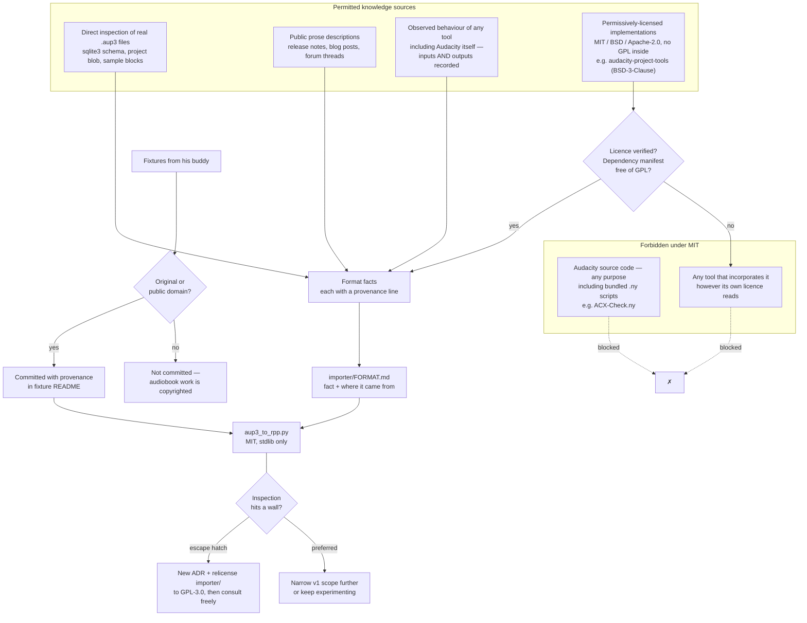

# ADR-0005: MIT licence, and a clean-room rule for everything derived from Audacity

## Context and Problem Statement

The repository is public and has no `LICENSE` file, which means it is currently "all rights reserved" by default — the opposite of the intent. Separately, `PLAN.md` commits to a clean-room note for Phase 2: "read the format by inspecting files, don't port Audacity's GPL source."

These two questions are one decision. Audacity is GPL-2.0-or-later. If this project were GPL-licensed, consulting and porting Audacity's source would be entirely legitimate and the reverse-engineering problem would largely dissolve. Under a permissive licence it is not, and the `.aup3` format has to be derived without it. (The 2026-08-15 amendment below establishes that "without Audacity's source" is not the same as "from inspection alone" — lawfully-licensed third-party implementations are also available, and one exists.)

The timing matters more than Phase 2's distance suggests. **The clean-room constraint governs how anyone is permitted to research the format starting now.** Deciding it after someone has already read Audacity's source is deciding it too late — the knowledge cannot be un-acquired, and the provenance of every subsequent design choice becomes arguable.

**What licence does the project carry, and what rule governs how anything is derived from Audacity?**

**Scope, widened 2026-08-16.** This ADR was originally written and titled as a `.aup3` decision, because `.aup3` was the only place reverse engineering was anticipated. That framing was too narrow, and the narrowness was not deliberate — it was an artifact of which problem happened to be in view. The rule's prohibition was always written project-wide ("by anyone working on this project"), while its title, its problem statement, its permitted-source list, and its escape hatch were all `.aup3`-specific. So the moment the prohibition bit anywhere else, it bit without any of the machinery that makes it workable.

That moment arrived: Audacity's own ACX Check ships as a readable Nyquist script inside `Audacity.app`, and our measurement disagrees with it by 0.77 dB on real material — a release blocker under SPEC-0001 REQ "Measurement Validation". The script is Audacity source, so the prohibition covers it; but nothing in the `.aup3` machinery helps, and the `importer/` relicense escape is irrelevant to a capability that has nothing to do with the importer.

The fix below is not a relaxation. The prohibition stays exactly as strict and is now explicitly project-wide on purpose rather than by accident. What changes is that the permitted alternatives are stated at the same scope, so the rule is workable wherever it applies.

## Decision Drivers

* **The repo is public with no licence**, which currently means nobody may legally use any of it. This is a live defect, not a housekeeping item.
* **ACX Check is meant to be shared.** `PLAN.md` frames the ACX gap as real for the whole Reaper audiobook community. Whatever licence it carries determines whether that sharing actually works.
* **The Reaper script ecosystem is permissively licensed.** ReaPack packages and community ReaScripts are overwhelmingly MIT or similar; a copyleft script is an outlier that people hesitate to build on.
* **Permissive is reversible; copyleft is not.** As sole copyright holder, relicensing `importer/` to GPL later is a decision available at any time. Once the project is GPL and other contributors have committed, unwinding it requires their agreement.
* **v1's importer scope is deliberately tiny.** `PLAN.md` scopes it to tracks, clips, positions, gain, and audio — explicitly not envelopes, effects, or labels. A SQLite schema is directly inspectable, so the clean-room constraint is cheap at this scope.
* **The provenance question outlives the code.** If this project is ever useful enough for someone to ask where the format knowledge came from, a contemporaneous record is worth far more than a recollection.
* **Fixtures are third-party content.** The `.aup3` files requested from his buddy are someone else's recordings landing in a public repo, which is a licensing question of its own.

## Considered Options

**Licence:** MIT everywhere · split (MIT for the kit, GPL-3.0 for `importer/`) · GPL-3.0 everywhere · Apache-2.0 everywhere

**Clean-room rule:** strict (never open Audacity source) · moderate (read for facts, never copy code) · no constraint (rely on interoperability exceptions)

## Decision Outcome

### Licence: MIT, whole repository

Chosen because the piece with the most external value — `ACXCheck.lua` — is the piece a copyleft licence would most restrict, and because this choice preserves rather than forecloses the alternative.

MIT matches the Reaper ecosystem's norm, so a narrator who finds `ACXCheck.lua` through ReaPack can use it without thinking about licensing at all. That is the outcome `PLAN.md` wants when it calls the ACX gap "genuinely useful to the wider Reaper audiobook community."

The GPL option is not lost. **Relicensing `importer/` to GPL-3.0 remains available at any moment**, because the copyright is held solely by one person. If reverse engineering stalls on some sample-block detail that inspection cannot resolve, the escape is a deliberate relicense of that directory plus a new ADR — not a quiet decision to peek.

**That escape covers `importer/` and nothing else.** It is a directory relicense, so it does nothing for `scripts/acx/` or any other part of the kit — a point worth stating because the natural moment to reach for an escape hatch is the moment you are stuck, which is exactly when its scope stops being read carefully. For everything outside `importer/`, source 4 above is the route: observe the behaviour and record it. Relicensing `ACXCheck.lua` to consult Audacity's Nyquist script would forfeit the community reuse that is the whole reason that file is written well, and would trade it for something a few controlled measurements can establish anyway. Choosing MIT now costs nothing that cannot be bought back later; choosing GPL now costs the community reuse permanently.

A `LICENSE` file at the repository root, plus SPDX identifiers in source files as they are written.

### Clean-room: strict about Audacity's source, not about everything adjacent to it

**Audacity's source is not to be read by anyone working on this project, for any purpose.** That is the absolute, and it is project-wide deliberately: it covers the `.aup3` format, ACX Check's measurement conventions, Noise Reduction's behaviour, and anything else this kit ever tries to match. "Source" includes the bundled Nyquist scripts inside `Audacity.app` — `ACX-Check.ny` and its siblings are shipped source, not documentation, however readable they are.

Anything derived from Audacity is derived from four permitted sources:

1. **Inspection of real files** — opening a `.aup3` SQLite database, reading its schema, examining the project blob and sample blocks directly. More generally: reading the artifacts Audacity *produces*, which are the user's data rather than Audacity's expression.
2. **Public prose descriptions** — blog posts, release notes, forum threads, format write-ups that describe behaviour in words rather than reproducing code.
3. **Permissively-licensed third-party implementations** — source that is MIT, BSD, Apache-2.0, or similar, and that does not itself incorporate Audacity's GPL code. Reading these is permitted; so is adapting them, subject to their attribution terms.
4. **Observed behaviour, recorded as input/output pairs.** Audacity may be run, fed signals or files chosen to isolate a question, and its answers written down. A convention recovered this way — "given a −20 dBFS sine, ACX Check reports X" — is a measurement of the program, not a copy of it, and it is the right tool wherever the goal is *agreeing with* Audacity rather than reimplementing it.

Source 4 is what makes the prohibition workable outside `.aup3`. It carries one discipline, which is what separates it from guessing: **the inputs and the observed outputs are both recorded**, so the derivation can be re-run and checked by someone who does not trust it. An unrepeatable observation is an anecdote.

The third source is a correction, made 2026-08-15, to a rule that originally reached further than its own reasoning did.

**What the correction fixes.** The original text read: *"This extends to GPL-licensed tooling built on Audacity's codebase, including `audacity-project-tools`. Its behaviour may be observed; its source may not be read."* Both halves of that premise are false. `audacity-project-tools` is **BSD-3-Clause**, per its repository metadata, and it is not built on Audacity's codebase — it has no submodules, its only vendored dependency is SQLite, and its full dependency manifest is fmt, sqlite3, SQLiteCpp, gflags, utfcpp, and boost. It is a small, independent reimplementation, not a fork.

**Why the correction is the right call rather than a convenient one.** The rationale in the Context above is specifically about copyleft: Audacity is GPL, this project is MIT, and porting GPL source into an MIT project is what is not permitted. BSD-3-Clause into MIT is permitted, with attribution — it raises none of the concern the rule was written to address. A prohibition that survives the disappearance of its own justification is superstition, not discipline.

The cost of getting this wrong in the strict direction was concrete. `audacity-project-tools` contains `ProjectBlobReader`, `BinaryXMLConverter`, `SampleFormat`, and `WaveFile` — an almost exact list of the unknowns `importer/FORMAT.md` records as unresolved, and of the sample-block encoding this ADR's own Consequences name as the likely dead end. The rule as originally written forbade the one lawful shortcut through the hardest part of Phase 2.

**What does not change.** Audacity's own source stays unread, whatever the provocation, and so does the source of any tool that incorporates it. The permissive exception is not a general licence to go looking for code that solves the problem; it is scoped to implementations whose licence makes reading them lawful for an MIT project.

**Attribution is not optional.** Anything adapted from a permissively-licensed implementation carries its copyright notice and licence text as that licence requires, and a provenance note naming the tool, the version, and what was taken. BSD-3-Clause compliance is cheap, and skipping it would reintroduce exactly the licensing exposure this ADR exists to prevent.

**Every derived fact carries a provenance note.** As understanding accumulates, each non-obvious fact is recorded with where it came from — "derived from `sqlite3 fixture.aup3 .schema`", "stated in the Audacity 3.0 release announcement", "observed: a −20 dBFS sine through ACX Check reports −20.0". This costs almost nothing while the knowledge is being acquired and is nearly impossible to reconstruct afterward.

Facts about the `.aup3` format live in `importer/FORMAT.md`. Facts derived by observing Audacity's behaviour live with the capability that needed them — a measurement convention belongs beside ACX Check, not in a format document about a different subsystem. The discipline is the same wherever it lands: fact, source, and enough detail to re-run it.

This is not a formal two-person clean room, where one party writes a specification and a second implements it blind. That ceremony is disproportionate to a solo hobby project, and the no-reading rule already provides the property that matters: no Audacity code has passed through the author's hands. Reading a BSD-3-Clause reimplementation does not weaken that property — no Audacity code passes through the author's hands that way either. It weakens a different and much softer claim, that the format knowledge was derived here rather than inherited, and that claim is worth less than a working importer.

### Fixtures: original or public-domain only

The `.aup3` fixtures requested in `docs/audacity-reference-request.md` are recordings made by someone else, committed to a public repository. Two rules:

* **Content must be original or public domain.** The request document already asks for throwaway reads of public-domain text rather than client audiobook work; this ADR makes that a repository rule rather than a politeness.
* **Fixtures are contributed under the repository licence**, recorded in the importer's fixture README with who provided them and confirmation of the above.

Audiobook narration is copyrighted work-for-hire. A publisher's material in a public repo is a problem for the narrator, not just for us.

### Consequences

* Good, because the repository becomes legally usable at all, which it currently is not.
* Good, because `ACXCheck.lua` can be adopted by any Reaper user without a licensing conversation — the condition for `PLAN.md`'s community-contribution goal to mean anything.
* Good, because the rule about Audacity's own source stays unambiguous. "Never open it" requires no judgement in the moment, which is exactly what a rule about temptation should require.
* Good, because the permissive exception restores a lawful path through the hardest part of Phase 2 — project-blob and sample-block encoding — without touching the copyleft boundary that motivated the rule.
* Good, because provenance notes are being written while the knowledge is fresh, when they are nearly free.
* Good, because the GPL escape stays genuinely available, so the strict rule does not become a reason to work around itself.
* Good, because the fixture rule protects his buddy from a mistake he has no reason to anticipate.
* **Bad, because a format detail may still resist derivation.** Sample-block and project-blob encoding remain the likely candidates. The permissive exception makes this much less likely than the original text feared — a lawful implementation of both exists — but if a detail resists even that, the options are unchanged: keep experimenting, narrow v1's scope, or relicense `importer/` and consult Audacity directly.
* **Bad, because the permissive exception requires judgement where the original required none.** "Is this licence permissive, and does this project incorporate GPL code?" is a question that can be got wrong, and got wrong quietly. The mitigation is the attribution and provenance requirement: anything adapted names its source, so a wrong call is visible in the record rather than buried in a commit.
* Bad, because MIT permits a third party to take `ACXCheck.lua` into a closed product with no reciprocity. Given the aim is adoption rather than capture, this is a cost worth accepting rather than a harm.
* Bad, because provenance notes are discipline, and discipline decays. The mitigation is that they are only required while the format is being learned, which is a bounded window.
* Neutral, because SPDX headers add a line to every file. Cheap, and they make the licence legible where people actually look.

### Confirmation

* **A `LICENSE` file exists at the repository root** before any further code lands. This is the fix for a live defect and should not wait on Phase 2.
* **The importer ships with a format document** whose non-obvious facts each carry a provenance line. A fact with no stated source is treated as a review failure, because it is indistinguishable from a remembered one.
* **The fixture README records provenance and content confirmation** for every committed `.aup3`, and no fixture is committed without it.
* **Every permissively-licensed implementation read is verified before it is read**, not after. Its declared licence and its dependency manifest are both checked, and the check is recorded in `importer/FORMAT.md`. A permissive licence on a project that vendors GPL code does not make the GPL code permissive.
* **Behavioural derivations record their inputs and outputs**, not just their conclusions. "ACX Check reports −33.36 dB on `D1.wav`; we compute −34.13" is a usable record; "Audacity measures RMS differently" is not. The test is whether a sceptic can re-run it.
* **If the rule against Audacity's own source is ever relaxed, it happens as an ADR that supersedes this one**, plus an explicit relicense of the affected directory. A commit that quietly reflects Audacity source knowledge is the failure mode this decision exists to prevent, and it is detectable only by the person who wrote it — which makes the norm, not the review, the actual control. Neither amendment to date is an instance of this. The 2026-08-15 correction widened the permitted sources to include lawful ones; the 2026-08-16 correction widened the *scope* to match where the prohibition already reached. Both left the prohibition itself exactly where it was.

## Pros and Cons of the Options

### Licence

**MIT everywhere** — Good, because it matches the Reaper ecosystem norm and maximizes reuse of the component with external value. Good, because it is short enough that people actually read it. Good, because it preserves the GPL option as a later, deliberate move. Neutral, because it offers no patent grant, which this project does not need. Bad, because it forbids consulting Audacity's source, making the importer harder.

**Split — MIT for the kit, GPL-3.0 for `importer/`** — Good, because it removes the reverse-engineering constraint from the hardest phase while keeping the scripts permissive. Good, because the two halves genuinely are independent artifacts with different lineage risk. Bad, because it commits to GPL before knowing whether inspection alone would have sufficed — and inspection probably does suffice at v1's scope. Bad, because two licences in one repository need explaining to every contributor and every user.

**GPL-3.0 everywhere** — Good, because it gives maximum freedom to build on Audacity's work. Good, because copyleft keeps derivatives open. Bad, because it makes `ACXCheck.lua` copyleft in an ecosystem that is not, undercutting the sharing goal that motivates writing it well. Bad, because it is the hardest option to reverse once contributors appear.

**Apache-2.0 everywhere** — Good, because it is permissive with an explicit patent grant and clear contribution terms. Good, because it is well understood by corporate users. Neutral, because the patent grant addresses a risk this project does not plausibly face. Bad, because it is more verbose than the ecosystem norm for a repository of small scripts.

### Clean-room rule

**Strict — never open Audacity source** — Good, because it requires no judgement in the moment. Good, because it produces the cleanest possible provenance story. Good, because it is cheap at v1's deliberately small scope. Bad, because it can produce a genuine dead end on a detail that inspection cannot resolve.

**Moderate — read for facts, never copy code** — Good, because it is far faster when stuck, and reading a format constant is not obviously copying. Bad, because the boundary between "learned a fact" and "reproduced a structure" is blurry, and the author would be the one arguing it afterward with no contemporaneous record. Bad, because it converts a bright line into a judgement call at precisely the moment of frustration, which is when judgement is worst.

**No constraint** — Good, because it is simplest and interoperability reverse engineering has real legal protection in several jurisdictions. Bad, because it takes on genuine ambiguity for a public repository. Bad, because it reverses a position `PLAN.md` already states, which would need justifying rather than merely deciding.

## Architecture Diagram

## More Information

* Audacity is licensed GPL-2.0-or-later, which is the entire reason this decision has two halves rather than one.
* [ADR-0002](ADR-0002-config-source-of-truth-and-build.md) established stdlib-only Python for tooling; [ADR-0003](ADR-0003-dependency-policy.md) clarified that the constraint binds shipped code rather than test code. Both apply to `importer/` and neither is changed here.
* `PLAN.md`, Phase 2 for the clean-room commitment this ADR formalizes and the v1 scope that makes it affordable, and for the note that the existing converters ([Zylann's](https://github.com/Zylann/audacity2reaper), [nershman's fork](https://github.com/nershman/audacity2.0reaper)) only read the legacy `.aup` XML format — meaning there is no prior `.aup3` implementation to be tempted by either.
* `docs/audacity-reference-request.md` is where the fixture rule reaches the person who will actually provide the files.

**Immediate follow-up, independent of Phase 2:**

* Add `LICENSE` (MIT) at the repository root. The repo is public and currently unlicensed, so this should not wait for the importer.
* Add a licence line to `README.md` when it is written.

**Note on scope:** this ADR governs provenance and permissions. It does not decide the importer's architecture — module layout, how `.rpp` is generated, or how fixtures drive tests — which remains open and belongs in a spec once Phase 2 begins.
