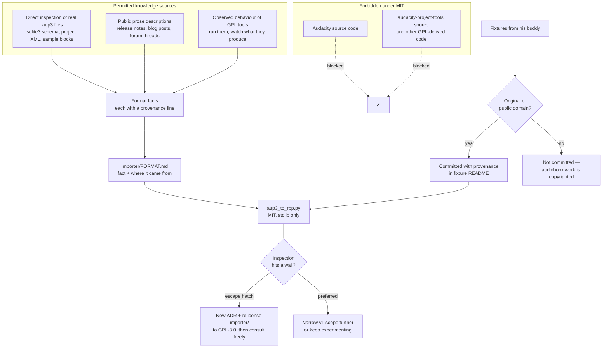

# ADR-0005: MIT licence with a strict clean-room rule for `.aup3` reverse engineering

## Context and Problem Statement

The repository is public and has no `LICENSE` file, which means it is currently "all rights reserved" by default — the opposite of the intent. Separately, `PLAN.md` commits to a clean-room note for Phase 2: "read the format by inspecting files, don't port Audacity's GPL source."

These two questions are one decision. Audacity is GPL-2.0-or-later. If this project were GPL-licensed, consulting and porting Audacity's source would be entirely legitimate and the reverse-engineering problem would largely dissolve. Under a permissive licence it is not, and the `.aup3` format has to be derived from inspection alone.

The timing matters more than Phase 2's distance suggests. **The clean-room constraint governs how anyone is permitted to research the format starting now.** Deciding it after someone has already read Audacity's source is deciding it too late — the knowledge cannot be un-acquired, and the provenance of every subsequent design choice becomes arguable.

**What licence does the project carry, and what rule governs how `.aup3` gets reverse engineered?**

## Decision Drivers

* **The repo is public with no licence**, which currently means nobody may legally use any of it. This is a live defect, not a housekeeping item.
* **ACX Check is meant to be shared.** `PLAN.md` frames the ACX gap as real for the whole Reaper audiobook community. Whatever licence it carries determines whether that sharing actually works.
* **The Reaper script ecosystem is permissively licensed.** ReaPack packages and community ReaScripts are overwhelmingly MIT or similar; a copyleft script is an outlier that people hesitate to build on.
* **Permissive is reversible; copyleft is not.** As sole copyright holder, relicensing `importer/` to GPL later is a decision available at any time. Once the project is GPL and other contributors have committed, unwinding it requires their agreement.
* **v1's importer scope is deliberately tiny.** `PLAN.md` scopes it to tracks, clips, positions, gain, and audio — explicitly not envelopes, effects, or labels. A SQLite schema is directly inspectable, so the clean-room constraint is cheap at this scope.
* **The provenance question outlives the code.** If this project is ever useful enough for someone to ask where the format knowledge came from, a contemporaneous record is worth far more than a recollection.
* **Fixtures are third-party content.** The `.aup3` files requested from his buddy are someone else's recordings landing in a public repo, which is a licensing question of its own.

## Considered Options

**Licence:** MIT everywhere · split (MIT for the kit, GPL-3.0 for `importer/`) · GPL-3.0 everywhere · Apache-2.0 everywhere

**Clean-room rule:** strict (never open Audacity source) · moderate (read for facts, never copy code) · no constraint (rely on interoperability exceptions)

## Decision Outcome

### Licence: MIT, whole repository

Chosen because the piece with the most external value — `ACXCheck.lua` — is the piece a copyleft licence would most restrict, and because this choice preserves rather than forecloses the alternative.

MIT matches the Reaper ecosystem's norm, so a narrator who finds `ACXCheck.lua` through ReaPack can use it without thinking about licensing at all. That is the outcome `PLAN.md` wants when it calls the ACX gap "genuinely useful to the wider Reaper audiobook community."

The GPL option is not lost. **Relicensing `importer/` to GPL-3.0 remains available at any moment**, because the copyright is held solely by one person. If reverse engineering stalls on some sample-block detail that inspection cannot resolve, the escape is a deliberate relicense of that directory plus a new ADR — not a quiet decision to peek. Choosing MIT now costs nothing that cannot be bought back later; choosing GPL now costs the community reuse permanently.

A `LICENSE` file at the repository root, plus SPDX identifiers in source files as they are written.

### Clean-room: strict

**Audacity's source is not to be read by anyone working on this project.** The `.aup3` format is derived from two permitted sources only:

1. **Inspection of real `.aup3` files** — opening the SQLite database, reading its schema, examining the project XML and sample blocks directly.
2. **Public prose descriptions** — blog posts, release notes, forum threads, format write-ups that describe the format in words rather than reproducing code.

This extends to GPL-licensed tooling built on Audacity's codebase, including `audacity-project-tools`. Its *behaviour* may be observed; its source may not be read.

**Every format fact carries a provenance note.** As the importer's understanding of `.aup3` accumulates, each non-obvious fact is recorded with where it came from — "derived from `sqlite3 fixture.aup3 .schema`", "stated in the Audacity 3.0 release announcement". This lives alongside the importer as a format document and costs almost nothing to maintain while the knowledge is being acquired. Reconstructing it afterward is nearly impossible.

This is not a formal two-person clean room, where one party writes a specification and a second implements it blind. That ceremony is disproportionate to a solo hobby project, and the strict no-reading rule already provides the property that matters: no Audacity code has passed through the author's hands.

### Fixtures: original or public-domain only

The `.aup3` fixtures requested in `docs/audacity-reference-request.md` are recordings made by someone else, committed to a public repository. Two rules:

* **Content must be original or public domain.** The request document already asks for throwaway reads of public-domain text rather than client audiobook work; this ADR makes that a repository rule rather than a politeness.
* **Fixtures are contributed under the repository licence**, recorded in the importer's fixture README with who provided them and confirmation of the above.

Audiobook narration is copyrighted work-for-hire. A publisher's material in a public repo is a problem for the narrator, not just for us.

### Consequences

* Good, because the repository becomes legally usable at all, which it currently is not.
* Good, because `ACXCheck.lua` can be adopted by any Reaper user without a licensing conversation — the condition for `PLAN.md`'s community-contribution goal to mean anything.
* Good, because the strict rule is unambiguous. "Never open it" requires no judgement in the moment, which is exactly what a rule about temptation should require.
* Good, because provenance notes are being written while the knowledge is fresh, when they are nearly free.
* Good, because the GPL escape stays genuinely available, so the strict rule does not become a reason to work around itself.
* Good, because the fixture rule protects his buddy from a mistake he has no reason to anticipate.
* **Bad, because a format detail may resist inspection.** Sample-block encoding is the likely candidate. If it does, the options are to keep experimenting, narrow v1's scope further, or relicense `importer/` and consult — and only the last is fast. The strict rule buys clarity at the cost of a possible dead end.
* Bad, because MIT permits a third party to take `ACXCheck.lua` into a closed product with no reciprocity. Given the aim is adoption rather than capture, this is a cost worth accepting rather than a harm.
* Bad, because provenance notes are discipline, and discipline decays. The mitigation is that they are only required while the format is being learned, which is a bounded window.
* Neutral, because SPDX headers add a line to every file. Cheap, and they make the licence legible where people actually look.

### Confirmation

* **A `LICENSE` file exists at the repository root** before any further code lands. This is the fix for a live defect and should not wait on Phase 2.
* **The importer ships with a format document** whose non-obvious facts each carry a provenance line. A fact with no stated source is treated as a review failure, because it is indistinguishable from a remembered one.
* **The fixture README records provenance and content confirmation** for every committed `.aup3`, and no fixture is committed without it.
* **If the strict rule is ever relaxed, it happens as an ADR that supersedes this one**, plus an explicit relicense of `importer/`. A commit that quietly reflects source knowledge is the failure mode this decision exists to prevent, and it is detectable only by the person who wrote it — which makes the norm, not the review, the actual control.

## Pros and Cons of the Options

### Licence

**MIT everywhere** — Good, because it matches the Reaper ecosystem norm and maximizes reuse of the component with external value. Good, because it is short enough that people actually read it. Good, because it preserves the GPL option as a later, deliberate move. Neutral, because it offers no patent grant, which this project does not need. Bad, because it forbids consulting Audacity's source, making the importer harder.

**Split — MIT for the kit, GPL-3.0 for `importer/`** — Good, because it removes the reverse-engineering constraint from the hardest phase while keeping the scripts permissive. Good, because the two halves genuinely are independent artifacts with different lineage risk. Bad, because it commits to GPL before knowing whether inspection alone would have sufficed — and inspection probably does suffice at v1's scope. Bad, because two licences in one repository need explaining to every contributor and every user.

**GPL-3.0 everywhere** — Good, because it gives maximum freedom to build on Audacity's work. Good, because copyleft keeps derivatives open. Bad, because it makes `ACXCheck.lua` copyleft in an ecosystem that is not, undercutting the sharing goal that motivates writing it well. Bad, because it is the hardest option to reverse once contributors appear.

**Apache-2.0 everywhere** — Good, because it is permissive with an explicit patent grant and clear contribution terms. Good, because it is well understood by corporate users. Neutral, because the patent grant addresses a risk this project does not plausibly face. Bad, because it is more verbose than the ecosystem norm for a repository of small scripts.

### Clean-room rule

**Strict — never open Audacity source** — Good, because it requires no judgement in the moment. Good, because it produces the cleanest possible provenance story. Good, because it is cheap at v1's deliberately small scope. Bad, because it can produce a genuine dead end on a detail that inspection cannot resolve.

**Moderate — read for facts, never copy code** — Good, because it is far faster when stuck, and reading a format constant is not obviously copying. Bad, because the boundary between "learned a fact" and "reproduced a structure" is blurry, and the author would be the one arguing it afterward with no contemporaneous record. Bad, because it converts a bright line into a judgement call at precisely the moment of frustration, which is when judgement is worst.

**No constraint** — Good, because it is simplest and interoperability reverse engineering has real legal protection in several jurisdictions. Bad, because it takes on genuine ambiguity for a public repository. Bad, because it reverses a position `PLAN.md` already states, which would need justifying rather than merely deciding.

## Architecture Diagram

## More Information

* Audacity is licensed GPL-2.0-or-later, which is the entire reason this decision has two halves rather than one.
* [ADR-0002](ADR-0002-config-source-of-truth-and-build.md) established stdlib-only Python for tooling; [ADR-0003](ADR-0003-dependency-policy.md) clarified that the constraint binds shipped code rather than test code. Both apply to `importer/` and neither is changed here.
* `PLAN.md`, Phase 2 for the clean-room commitment this ADR formalizes and the v1 scope that makes it affordable, and for the note that the existing converters ([Zylann's](https://github.com/Zylann/audacity2reaper), [nershman's fork](https://github.com/nershman/audacity2.0reaper)) only read the legacy `.aup` XML format — meaning there is no prior `.aup3` implementation to be tempted by either.
* `docs/audacity-reference-request.md` is where the fixture rule reaches the person who will actually provide the files.

**Immediate follow-up, independent of Phase 2:**

* Add `LICENSE` (MIT) at the repository root. The repo is public and currently unlicensed, so this should not wait for the importer.
* Add a licence line to `README.md` when it is written.

**Note on scope:** this ADR governs provenance and permissions. It does not decide the importer's architecture — module layout, how `.rpp` is generated, or how fixtures drive tests — which remains open and belongs in a spec once Phase 2 begins.
