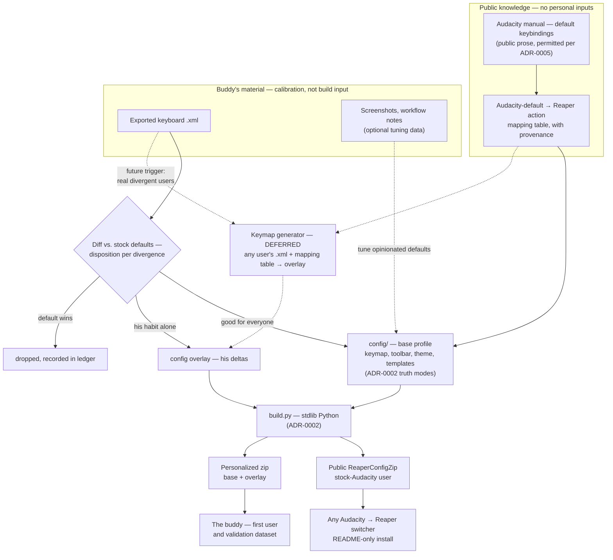

# ADR-0006: Design the bridge for stock Audacity — base profile with personal overlays

## Context and Problem Statement

The kit was conceived for one narrator, and its config layer is currently specified in terms of *his* material: `docs/audacity-reference-request.md` asks him for his keyboard shortcuts as an `.xml` export, screenshots of his window layout and effect dialogs, and his macros, and `PLAN.md` builds the keymap, toolbar, and templates from those answers. But the repository is public and MIT-licensed precisely because the gaps it fills — ACX Check, the `.aup3` importer — are real for every Audacity narrator considering Reaper. Two of the three artifacts already serve that audience: the ReaPack scripts contain nothing personal ([ADR-0001](ADR-0001-distribution-and-install-model.md) calls the repo "a public artifact"), and the importer is generic by nature. Only the config zip is pinned to one person — and it is pinned to inputs (screenshots, a walkthrough of his habits) that no other user will ever supply.

**Who is the config zip for, and how do an individual user's Audacity habits get accommodated, when per-user reference material does not scale beyond one buddy?**

## Decision Drivers

* **The reference material splits cleanly by kind.** The request document asks for two different things without saying so: machine-readable exports (the keyboard `.xml`, macro files, `.aup3` fixtures) and screenshots (effect values, window layout). Exports generalize into *input formats any user can produce in two clicks*; screenshots only ever generalize into *opinionated defaults*, because effect settings for ACX narration are convergent and window layout is already an original design ("Simple Edit"), not a copy of anyone's screen.
* **Most Audacity users run near-stock keybindings**, and Audacity's default keymap is publicly documented in its manual — a permitted source under [ADR-0005](ADR-0005-license-and-clean-room.md)'s clean-room rule (public prose, not source code).
* **ADR-0001's adoption-risk reasoning assumed a hand-holding human.** Every install step for the buddy has the author standing behind it. A stranger gets only the README, so whatever the kit ships publicly must survive being followed cold.
* **The buddy's habits may diverge from stock Audacity**, and his muscle memory is still the project's first loyalty. Divergence needs a home that is neither "silently baked into the public artifact" nor "lost."
* **KISS is a standing principle.** `PLAN.md`: "we are not writing an app." A keymap-generator tool that reads any user's Audacity export is attractive and is also exactly the kind of scope creep that principle exists to stop.
* **The kit is currently blocked on homework.** Phase 1 waits on the buddy's reference material; a design that needs it only for calibration can start now.
* **ADR-0002's build already exists as machinery.** Composing an overlay before zipping is an increment to `build.py`, not a new system.

## Considered Options

* **Stock-Audacity base profile, personal deltas as overlays** — the public zip targets a stock-Audacity user; the buddy's material becomes calibration and an overlay
* **Personal-first, genericize later** — build for the buddy as planned, extract a generic version once it works (the status quo implied by `PLAN.md`)
* **Generic-only** — ship one opinionated profile and no personalization mechanism at all; anyone, including the buddy, hand-edits after import
* **Generator-first** — build the keymap generator now; every user, including the buddy, generates their config from their own Audacity `.xml` export

## Decision Outcome

Chosen option: **"Stock-Audacity base profile, personal deltas as overlays,"** because it makes the public artifact real without abandoning the person the project is for — and because the work it requires (an Audacity-default → Reaper action mapping) is a strict prerequisite of every other option anyway.

Concretely:

* **The shipped config zip targets a stock-Audacity user.** The keymap is authored from Audacity's *default* bindings as documented in the Audacity manual, with a provenance line per ADR-0005's convention. Theme, "Simple Edit" screenset, toolbar, templates, and voice-chain values are opinionated defaults — they never needed personal screenshots; they needed design.
* **The buddy becomes the generic product's first user, not its spec.** His exported keyboard `.xml` is diffed against Audacity's defaults. Each divergence gets an explicit disposition: *adopt into the base* (if it is a good idea for everyone), *record in his overlay* (if it is his habit alone), or *drop* (if the default wins). His reference material calibrates and validates; it is no longer a build input for the public artifact.
* **Personal deltas are overlays composed at build time.** An overlay is a small directory of deviations from the base that `build.py` applies before packaging, producing a personalized zip alongside — never instead of — the public one. Overlay artifacts obey ADR-0002's truth modes and manifest discipline. The exact overlay schema (file-level replacement vs. binding-level merge for the keymap) is spec territory, not decided here.
* **The reference request is reframed as optional calibration.** Nothing in it blocks the build. The machine-readable items (keyboard `.xml`, macros, `.aup3` fixtures) remain genuinely valuable; the screenshots become nice-to-have tuning data.

* **The first real overlay case is iZotope RX 9** (recorded 2026-08-16, once the reference material arrived). His ACX macro opens with RX 9 Mouth De-click, which he calls a necessity, and he has confirmed he is staying on RX 9. The modules are installed system-wide as AU and VST, so Reaper finds them unaided. This splits exactly the way this ADR predicted: the **base** ACX chain is stock-Reaper-only and shareable, and **his overlay** adds the RX 9 steps. Per [ADR-0003](ADR-0003-dependency-policy.md), an overlay may reference plugins the user owns precisely because it never ships them.

  Two details worth carrying into the spec rather than losing here. He applies RX 9 De-plosive and his graphic EQ *surgically or after the macro* today, but says both "could be added to the Macro" — so the overlay chain can automate two steps his Audacity macro never did, which is a place the Reaper version is straightforwardly better rather than merely equivalent. And "surgical" is a real usage mode, not a synonym for optional: a blanket chain step and a spot fix are different tools, and the overlay should offer the first without removing the second.
* **The generator tool is deliberately deferred.** A stdlib-Python tool that reads any user's Audacity keyboard `.xml` and emits keymap overrides from the mapping table is recorded as a future option, not built. Its trigger is demand: real users whose keymaps diverge from stock, arriving with their exports in hand. If built, it is development tooling under [ADR-0003](ADR-0003-dependency-policy.md)'s unconstrained tier — the runtime ceiling is untouched.

### Consequences

* Good, because the kit becomes installable by strangers, which is what the repository's public MIT posture has promised since the README was written. ADR-0001 put the scripts on a public channel; this extends the same logic to the config layer.
* Good, because the project unblocks. The base profile can be authored today from public documentation; the buddy's material improves it when it arrives instead of gating it.
* Good, because buddy-as-first-user makes the acceptance tests do double duty: every Phase 1 test he passes is also evidence about the generic product, minus his overlay.
* Good, because the base/overlay split keeps Phase 3's graduation path legible. Retiring bridge bindings edits the base — a readable diff per ADR-0002 — while personal overlays are untouched, and the divergence ledger records *whose* habit each binding served.
* Good, because the Audacity-default mapping table built for the base profile is the durable community asset, and it is on the path to the generator rather than a detour from it.
* **Bad, because the README is promoted from courtesy to product surface.** For strangers, the install documentation carries all the adoption-risk weight ADR-0001 assigned to a human. That is real ongoing work this decision creates and cannot delegate.
* Bad, because the base profile now makes opinionated calls without user data — a keymap designed for an imagined median Audacity user can be wrong in ways one real user's material would have caught. Mitigation: the buddy's diff is exactly that catch, applied as calibration.
* Bad, because overlay composition adds a third concept to a build that ADR-0002 already gave two truth modes. The manifest and `build.py` grow; the spec has to keep the schema small enough that the overlay mechanism stays cheaper than the forks it prevents.
* Bad, because divergence review is manual, per user, until and unless the generator exists. For one buddy that is an afternoon; it does not scale, and this ADR explicitly accepts that it does not need to yet.
* Neutral, because the buddy's bridge is marginally less "his" — where the default wins a disposition, his muscle memory loses. The overlay exists precisely so this happens by decision rather than by accident.

### Confirmation

* **The public zip builds from the repository alone.** `build.py` produces the base-profile `.ReaperConfigZip` with zero reference-material inputs present. Personal material missing is not an error.
* **The divergence ledger exists and is complete.** Every difference between the buddy's exported keymap and Audacity's defaults has a recorded disposition (base / overlay / dropped). An unexplained divergence is a review failure.
* **The base keymap carries provenance.** Each binding traces to the Audacity manual's documented default or to a recorded design decision — the same discipline ADR-0005 requires of format facts.
* **A cold install of the base profile succeeds.** Someone (or a clean machine) follows the README start to finish — export config, import zip, install ReaPack, synchronize — with no author intervention. This is ADR-0001's backup rehearsal, re-run without the hand-holding human.
* **The buddy's Phase 1 acceptance test runs on base-plus-overlay**, confirming the overlay mechanism carries his actual habits rather than existing on paper.
* **`docs/audacity-reference-request.md` is updated** to mark every item as optional calibration, so the framing change reaches the one person currently holding homework.

## Pros and Cons of the Options

### Stock-Audacity base profile, personal deltas as overlays

The public artifact assumes stock Audacity; one person's habits become a composable overlay and a validation dataset.

* Good, because it is the only option that serves both audiences without forking the product.
* Good, because it starts from public documentation and unblocks immediately.
* Good, because divergences are handled by explicit disposition instead of silently shaping the public artifact.
* Good, because its core work (the default-keymap mapping table) is a prerequisite of the generator anyway — nothing is wasted if the generator is built later.
* Neutral, because it presumes most Audacity users run near-stock bindings — believed true, and cheaply corrected by the first real counterexample arriving with an export.
* Bad, because it adds overlay machinery to the build and manifest.
* Bad, because the base profile's opinions are initially validated by exactly one real user.

### Personal-first, genericize later

Build the kit for the buddy from his reference material, as `PLAN.md` describes; extract a generic version once it works.

* Good, because it is the fastest route to the buddy's first session, which `PLAN.md` names as the moment that decides adoption.
* Good, because every design question has an empirical answer: whatever his material says.
* Bad, because "later" decays. Once a personalized kit works, genericizing is unpaid rework with no user pulling for it, and the public repo goes on shipping an artifact only one person can use.
* Bad, because his assumptions bake in silently — with no diff against stock defaults, nobody can later say which bindings were his habits and which were design.
* Bad, because it leaves the project blocked on his homework, which is the current state this ADR exists to fix.

### Generic-only

Ship one opinionated profile; no overlay mechanism. Anyone whose habits differ hand-edits their Reaper after import.

* Good, because it is the simplest possible answer — one artifact, no composition machinery, nothing added to ADR-0002's build.
* Good, because Reaper's own preferences UI genuinely supports post-import tweaking.
* Bad, because the buddy's divergences land as undocumented hand-edits on his machine — exactly the machine-local, unreproducible state ADR-0002's `regenerate` rule was written to prevent.
* Bad, because a re-import (rollback, reinstall, new machine) silently erases those hand-edits, and the person least equipped to notice is the target user.
* Bad, because personalization pressure does not disappear; it returns as private forks of the config, which are strictly worse than overlays.

### Generator-first

Build the Audacity-`.xml` → Reaper-keymap generator now; every user, including the buddy, generates their own config.

* Good, because it is the most scalable answer — every user gets their actual muscle memory, not a median guess.
* Good, because the mapping table it requires is a genuine community asset.
* Bad, because it is the largest build before any value ships, against KISS and `PLAN.md`'s "we are not writing an app" — a tool with arbitrary user input, cross-version Audacity exports, and an unbounded testing surface.
* Bad, because it still needs the stock-default mapping as its foundation, so it cannot ship *sooner* than the base profile — only later.
* Bad, because its demand is unproven. Zero users have arrived with divergent keymaps; building for them first optimizes for a population that may not exist.

## Architecture Diagram

## More Information

* [ADR-0001](ADR-0001-distribution-and-install-model.md) made the scripts public via ReaPack and named the config zip "a personal artifact" — this ADR revises that half: the config zip becomes a public artifact with a personal overlay, extending ADR-0001's community argument to the bridge itself.
* [ADR-0002](ADR-0002-config-source-of-truth-and-build.md) owns the manifest and `build.py` that overlay composition extends. Its open question list gains one item: the overlay schema.
* [ADR-0005](ADR-0005-license-and-clean-room.md) governs the provenance discipline the base keymap adopts; the Audacity *manual* is public prose and therefore a permitted source. The clean-room rule is unaffected.
* `docs/audacity-reference-request.md` is the artifact this decision reframes — its items become optional calibration rather than prerequisites.
* `PLAN.md`, "Risks & gotchas": the keymap-conflict risk ("tutorials assume Reaper defaults") applies with more force to a public audience and belongs in the cheat sheet for both profiles.

**Open questions this ADR does not settle:**

* The overlay schema — file-level replacement versus binding-level merge for `reaper-kb.ini`, and how the manifest declares overlay membership — belongs in the config spec (`/sdd:spec`), alongside ADR-0002's existing manifest questions.
* Whether the *theme and screenset* ever admit overlays, or stay base-only. They are `extracted` artifacts, and per-user variants of binary blobs multiply the `regenerate` burden; the default answer should be base-only until proven otherwise.
* The generator's trigger condition is stated loosely ("real divergent users arrive"). If that day comes, the generator gets its own ADR, where its Audacity-version compatibility surface can be scoped honestly.

*No call graph is embedded: the repository contains no implementation code for this decision to map.*
