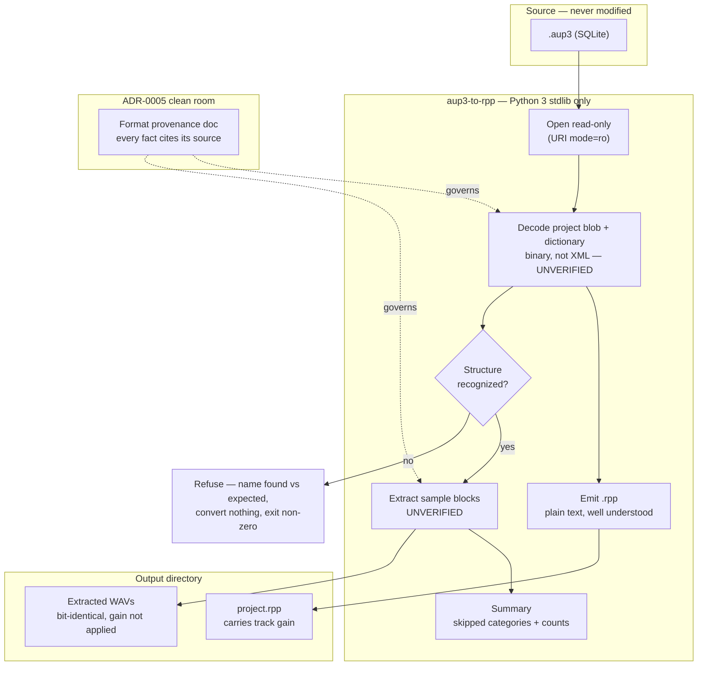

# Design: `.aup3` Importer

## Context

`PLAN.md` Phase 2 asks for a standalone CLI that opens the user's Audacity back catalogue in Reaper. The shape of the problem is unusually lopsided: one half is well understood and the other is not.

`.rpp` is plain text, documented by inspection, and stable — generating one is the easy half. `.aup3` is a SQLite database containing the project document plus audio sample blocks, introduced in Audacity 3.0. The only existing Audacity→Reaper converters read the *legacy* `.aup` XML format and are experimental even at that. Nobody has shipped a good `.aup3` converter, which is what makes this worth contributing and also what makes it Phase 2 rather than Phase 1.

[ADR-0005](../../../adrs/ADR-0005-license-and-clean-room.md) governs, and it constrains the *method* rather than the result: the format is derived from inspecting real files and reading public prose, never from reading Audacity's GPL source or the source of GPL tooling built on it. That is why [SPEC-0002](spec.md) carries a clean-room requirement with scenarios rather than a footnote — a research constraint that only exists as a note is one that gets forgotten under deadline pressure, and it cannot be un-violated once broken.

Two facts about the user shape everything below. The input projects are years of finished work and are irreplaceable. And the user will not read the code — they will open a converted project and look at whether their audio is where they left it.

**This spec is written ahead of its fixtures.** Real `.aup3` files have not yet arrived from the third party (`docs/audacity-reference-request.md`). The requirements are therefore written to be independent of the format details still to be derived: they constrain behaviour, fidelity, refusal, and provenance discipline, none of which change when the schema is finally read. The format facts themselves live in the provenance document, not in the spec.

## Goals / Non-Goals

### Goals

- Open the user's existing Audacity projects in Reaper with audio on the right tracks at the right times.
- Leave the source project byte-identical, always.
- Refuse clearly rather than convert wrongly.
- Derive the format under a discipline that keeps the licence defensible.
- Depend on nothing outside the Python 3 standard library.

### Non-Goals

- **Round-tripping.** This converts Audacity → Reaper. There is no path back, and building one would double the format surface for a user who is leaving Audacity.
- **Envelopes, effects, and labels.** Effects do not transfer meaningfully anyway — that is what Phase 1's FX chains are for. Labels are the first upgrade to consider for v1.1, since narrators use them for pickup points.
- **Fidelity to Audacity's rendering.** The goal is the user's material placed correctly, not a bit-exact reproduction of what Audacity would have played.
- **A GUI.** A CLI the user runs a handful of times, once per old project.
- **Recovering damaged projects.** `audacity-project-tools` exists for that; this importer assumes a readable project and refuses otherwise.

## Decisions

### Read-only enforced by the database, not by discipline

**Choice**: Open the project with SQLite's read-only URI mode so that any write attempt fails at the database layer.

**Rationale**: "We don't write to it" is a property that decays — one debugging session that opens the connection normally is enough. Enforcement at the connection makes the guarantee structural, and it also prevents SQLite from creating journal or write-ahead files beside the source, which is a subtler way of modifying the user's directory. This mirrors what SPEC-0001 does for ACX Check's read-only requirement, where the guarantee is enforced by a test stub rather than asserted in prose.

**Alternatives considered**:
- *Copy the file first, work on the copy*: rejected as the primary mechanism — these projects are large, and doubling disk usage per conversion is a real cost. It remains available as a user-side precaution.
- *Convention plus code review*: rejected. This is exactly the class of guarantee that a reviewer cannot reliably enforce.

### Gain is carried into the `.rpp`, never baked into the audio

**Choice**: Extracted audio is bit-identical to what the project holds. Per-track gain is expressed as Reaper track gain.

**Rationale**: Baking gain in is lossy and irreversible — the user could never recover the original level, and a conversion that quietly alters their audio is the kind of thing that destroys trust in the whole kit. Carrying it also means the extraction stage has no signal-processing in it at all, which removes an entire category of bug from the hardest part of the tool.

**Alternatives considered**:
- *Apply gain during extraction*: rejected as lossy, and it would put dithering and headroom decisions into a tool that has no business making them.

### Refuse on unrecognized structure rather than convert best-effort

**Choice**: An unrecognized project structure is a refusal. An unexpected element inside a recognized structure is a skip-and-report.

**Rationale**: The failure mode that matters is not a crash — it is a conversion that looks fine and is wrong, discovered after the user has built on it. Reverse-engineered format knowledge is exactly where that risk lives, because the parts not yet understood are invisible by definition. A refusal costs the user five minutes; a silently misplaced clip can cost a chapter. The asymmetry justifies erring hard toward refusal.

The two-level distinction matters: refusing an entire project because one unknown element appeared would make the tool useless as the format evolves, so the refusal is scoped to structures the importer cannot orient itself in at all.

**Alternatives considered**:
- *Best-effort conversion with warnings*: rejected. Warnings scroll past; misplaced audio does not announce itself.
- *Refuse on any unknown element*: rejected as too brittle to survive a single Audacity point release.

### The provenance document is a deliverable, not a comment

**Choice**: Format facts live in a maintained document beside the importer, each with a note recording where it came from. A fact without provenance may not inform the implementation.

**Rationale**: ADR-0005 requires this, and the reason is worth restating: if this project is ever useful enough for someone to ask where the format knowledge came from, a contemporaneous record is worth far more than a recollection. The cost is near zero while the knowledge is being acquired and near-impossible to pay later. Making it a gate on the implementation — no provenance, no use — is what keeps it from decaying into an aspiration.

### Python 3, standard library only

**Choice**: No third-party packages. `sqlite3` and `wave` are both built in.

**Rationale**: The whole tool is one file the user runs a handful of times. A dependency list turns that into an environment problem, and the two libraries that matter are already in the box. This mirrors ADR-0003's spirit for the Reaper side without being governed by it — ADR-0003's ceiling is about the *Reaper runtime*, and it does not reach a standalone Python CLI. Worth naming so nobody later cites ADR-0003 as forbidding something it never addressed.

### WAV as the extraction format

**Choice**: Extract to WAV.

**Rationale**: Reaper reads it natively, the stdlib writes it, and it is lossless. FLAC would save disk at the cost of a dependency or a subprocess, which is the wrong trade for a tool run a few times on a machine with a hard drive.

## Architecture

Three stages, deliberately separated so the risky ones are isolated. Emitting the `.rpp` is a well-understood text problem. The other two are not.

**Corrected after the prose survey** (`importer/FORMAT.md`): an earlier draft of this section called reading the project document a text problem too, on the assumption — inherited from `PLAN.md`, since corrected — that `.aup3` stores project XML. It does not. The public sources describe a pair of binary blobs: one a "dictionary" of tag and attribute names, the other the project structure referencing it. The `.aup` format that preceded `.aup3` was XML, which is the likely origin of the confusion. That moves project-document decoding out of the easy half and next to sample-block decoding, and it is the reason the diagram below marks two unverified stages rather than one.

The dotted edges are the point of the diagram: the provenance document is not documentation *about* the importer, it is an input *to* it. A fact that has not been written down with its source is not available to the code.

## Risks / Trade-offs

- **The project blob's encoding is now a second unknown, not just sample blocks.** The prose survey established that the project structure is a binary blob paired with a name dictionary, and did not establish how either is encoded — the one public pointer to the answer is inside Audacity's source, which ADR-0005 puts out of reach. → Same responses as below, but the risk is larger than the original draft assumed: two unverified stages rather than one, and a project that cannot be decoded yields nothing at all, where a sample-block failure at least yields structure.
- **Sample-block encoding may resist inspection.** This is the likely failure point, and ADR-0005 already anticipates it. → The permitted responses are further experimentation, narrowing v1 scope, or relicensing `importer/` under a new ADR. Reading Audacity's source is not among them, and the strict rule exists precisely so this pressure does not quietly become a reason to break it.
- **The format can change under us.** Audacity is actively developed; a point release could alter the schema. → The refusal path is the mitigation: an unrecognized structure fails loudly rather than converting wrongly, so drift surfaces as a refusal rather than as corrupted output.
- **Written before its fixtures exist.** The requirements may prove to be the wrong shape once a real project is inspected. → They are deliberately scoped to behaviour, fidelity, and discipline rather than to format specifics. If the shape is wrong, the correction is a spec revision informed by real files, which is the normal path.
- **Synthetic fixtures give false confidence.** A synthetic `.aup3` exercises only what the author already understood, which is the exact opposite of the test reverse-engineered knowledge needs. → SPEC-0002 makes real-project validation a requirement that synthetic fixtures explicitly cannot satisfy.
- **Three projects is a small sample.** They are the user's projects, so they may share settings that mask a whole class of bug. → Accepted for v1: the tool's purpose is opening *his* catalogue. Broader validation belongs to whatever adoption follows.

## Migration Plan

Greenfield — `importer/` does not exist yet. No migration.

Sequencing is gated rather than chosen: nothing beyond scaffolding can be built until real `.aup3` fixtures arrive, because under ADR-0005 the only permitted source of format knowledge is inspection of real files. The first work once they land is inspection and provenance capture, not code.

## Open Questions

- **How is the importer distributed?** ADR-0001 covers the config zip and ReaPack for the Reaper scripts. Neither channel fits a standalone Python CLI, and nothing currently decides this. Likely needs a short ADR — the plausible options are a single-file script in the repo, a PyPI package, or leaving it as "clone and run".
- **What is the placement tolerance in practice?** SPEC-0002 says one sample period. Whether Audacity expresses clip positions in samples or in seconds determines whether that is exact or merely tight, and that is a format fact awaiting inspection.
- **Does the user's Audacity version matter?** `.aup3` has existed since Audacity 3.0 and the schema may have shifted across releases. The reference request should establish which version produced the projects.
- **Are labels worth pulling forward to v1?** `PLAN.md` files them as a v1.1 candidate mapping to Reaper markers, and notes narrators use them for pickup points and corrections. If the user's projects lean on labels heavily, the case for v1 gets stronger — an answerable question once the fixtures arrive.
- **Multi-clip tracks and cross-fades.** Whether Audacity's clip model maps cleanly onto Reaper items, or whether adjacent clips carry implicit behaviour that needs representing, is unknown until a real project is inspected.
